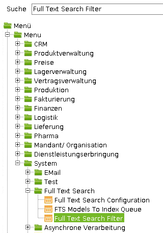

## Overview
This guide shows you how to activate/deactivate the full-text search (FTS) for business partners.

## Steps
1. Log in to the java back end with the role "System Administrator".
1. Open the FTS Index via **Full-Text Search Filter**.

    <kbd></kbd>

1. Find the database table (DB table) entry for business partners (bpartner).
    - To **activate FTS** for business partners, set the entry to `Active = Y`, and save.
    - To **deactivate FTS** for business partners, set the entry to `Active = N`, and save.

1. Restart the app server and the WebAPI server (or the whole stack).
