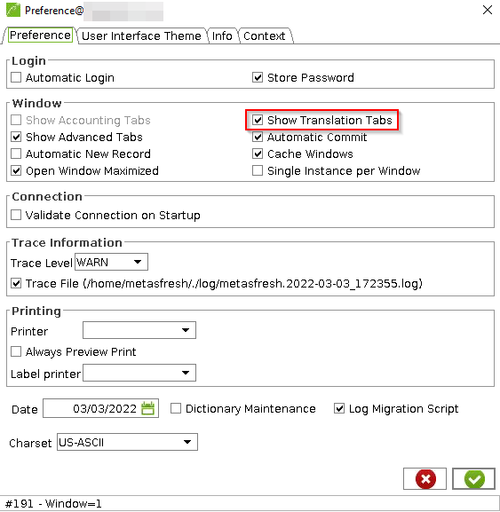

## Overview
This guide shows you how to activate translations in the Java Swing Client.

| **Important:** |
| :- |
| You have to restart the application afterwards to apply the changes. |

## Steps
1. Log in to the Java back end with role "System Administrator".
1. Open "Extras" or "Tools" from the menu bar and click "Settings" (*Einstellungen*).
1. Tick the checkbox **Show translations tab** (*Übersetzungs-Register zeigen*).

    
English: 
    <kbd></kbd>
    

    
German: 
    <kbd></kbd>
    

1. Click  to save the preferences.
1. Restart the swing client to apply the settings.
