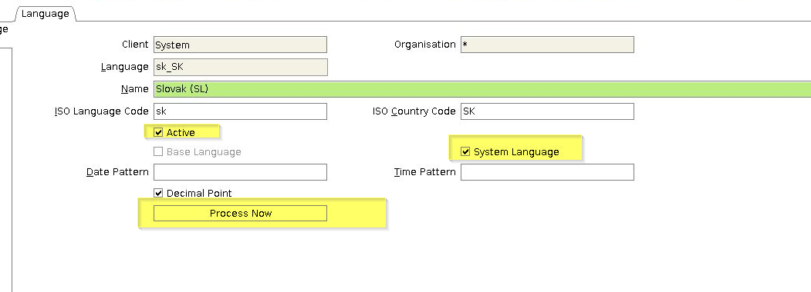

## Overview
This guide shows you how to activate existing language records, turn them into system languages and create all missing translation references.

In order to activate translations in the Java Swing Client, please see [here](activate_translations_tab).

## Steps
1. Log in to the Java back end using the role "System Administrator".
1. Go to "Language" (`WebUI > System > Language`).
1. [Look up the record](../../howto_collection/EN_tbd/How_to_search_inside_a_window) of the language you want to add to the system.
1. Tick the checkbox **Active**.
1. Tick the checkbox **System Language**.
1. Click "Process Now". An overlay window opens up.
   <kbd></kbd>

1. Pick the **Maintenance Mode** *Add Missing Translations* and click "Start". This will create all missing translations.
   <kbd></kbd>

 

| **Note for Admins:** |
| :--- |
| Missing translations are also added when starting the [App Server](../../howto_collection/EN/metasfresh_architecture). |

| **Note for WebUI:** |
| :--- |
| To make this feature available in the WebUI, be sure to set `webui_role='Y'` and `ad_role_id='0'`. |
