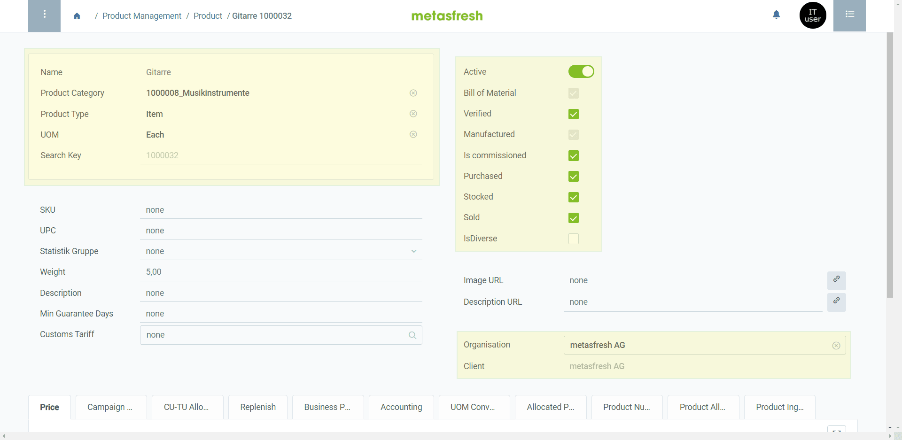
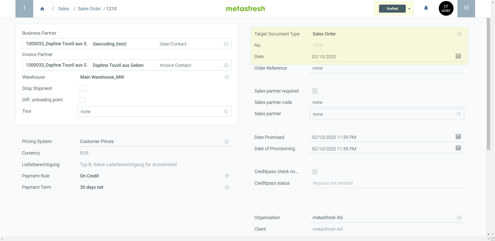
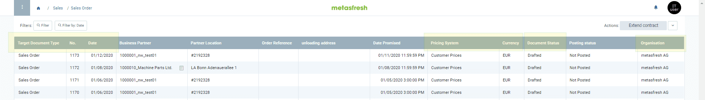
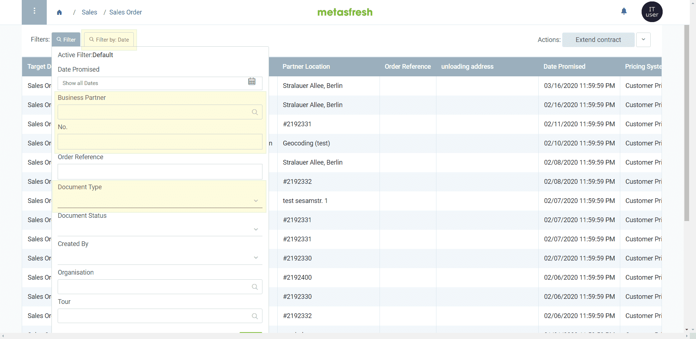
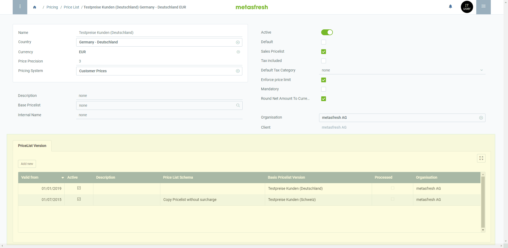

<!--
See original issue: https://github.com/metasfresh/metasfresh/issues/2045
-->

## Corner Stones for Windows

### Top Left
- Mandatory fields
- Very important fields

### Top Right
- Most important checkboxes and switches
- **Active** switch  shall be the first element at the top of the column

### Bottom Right
- Organisation
- Client

### Example
<kbd></kbd>

## Corner Stones for Documents

### Top Right
- Target Document Type
- Document Number
- Document Date
- **Note:** The document status is already displayed in the [document processing menu](../../webui_collection/EN/StartAction#doc-processing) at the top right of the document.

    

### Example
<kbd></kbd>

## Grid View for Documents
First 4 fields displayed must be:
- Target Document Type
- Document Number
- Document Date

Last 2 Fields displayed must be:
- Document Status
- Organisation

When displaying the following fields, always show them together:
- Pricing System / Pricelist
- Currency

### Example
<kbd></kbd>

## Grid View Order of Master Data
- Name ascending
    >**Note:** This applies to all master data grid views, e.g., business partners, products, price lists, etc.

## Grid View Order of Documents
- Document Date descending

## Grid View Order of Data with a "Valid from" Date
- "Valid from" date descending

## Field names for Documents
- Instead of "Target Document Type", write **Document Type**.
- Instead of "Document Date", write **Date**.
- Instead of "Document No.", write **No.**
- Instead of "Document Status", write **Status**.

## Default Filter for Documents
- Date (Document Date)
- Business Partner
- No. (Document No.)
- Document Type

### Example
<kbd></kbd>

## Included Record Tabs
- All the fields shall be in only 1 element group.
- This element group shall have a white background (primary UI).

### Example
<kbd></kbd>

## UOM
* Each time a quantity is shown, show the UOM next to it
* Each time a price is shown, show the price uom next to it ( unless it's the same as the uom above)
* If the UOM is missing in the data structure, create followupo to add it. 

## Dos and Dont's (unless the opposite is specifically requested) 
* If a column is a filter, the field for it should be displayed in grid view;
* If a list contains more than 10 entries, it should be changed into a search field;
* The Client (mandant) should not be displayed in a grid view;
* Any new field should be translated in German and English;
* Organization should be the last field displayed in grid view;
* In the advanced edit view of a subtab, the Organization and Client should be the last 2 fields displayed;
* When adding/modifying a virtual (SQL) column, make sure it gets updated when the source information updates.
