#### If you want to use a function, you need a process.
#### So that it can be displayed in the action menu.

## Steps
### 1.First you create a function that performs the actions you need.

### 2.There are 2 ways to implement this function as a process.
#### the first way is directly via the WebUI
For this you log in as **System Administrator**

<kbd></kbd>

From there, click on the house in the top left and select Report & Process

<kbd></kbd>

When you are in the Report & Process window go to the three dots (action menu) next to the house on the top left.
now create a new process with **New**

<kbd>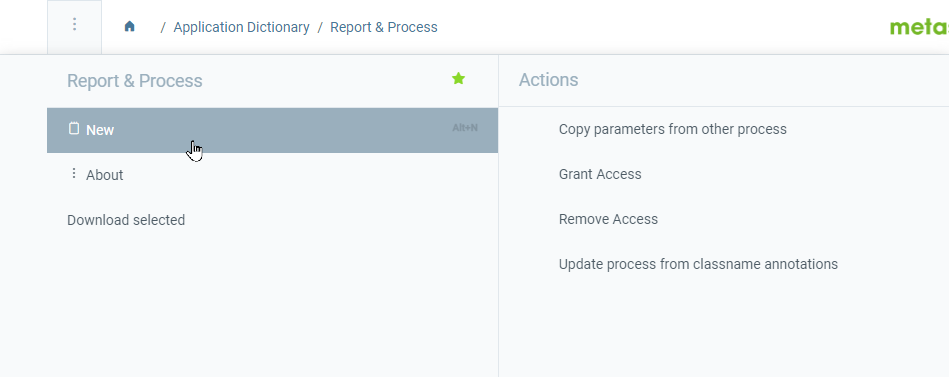</kbd>

from the new area that opens back to the three dots and click on **Advanced Edit**

<kbd>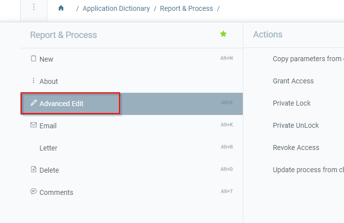</kbd>

1. Is a Key Word.
2. Is the name  which is displayed in the action menu.
3. Gives a usable schema.
4. Defines what type your function is.
5. Whether the process is active is displayed or not.
6. and 7.  Helpful comments go here.

<kbd>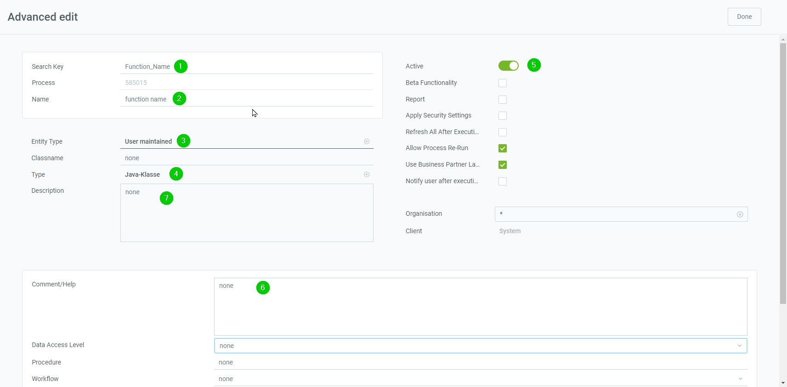</kbd>

In the Tab´s Report Access, Parameter,Assigned to tables you can Add new entries and in Statistics you con see Statistic Count Statistic, Milliseconds, Organisation.

<kbd>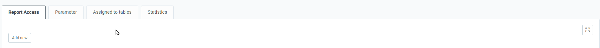</kbd>

Report Access: Here you enter the access rights for the roles.

<kbd>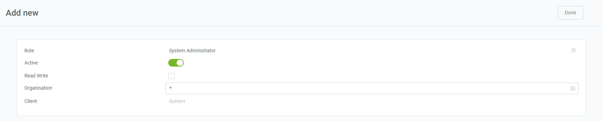</kbd>

Parameters:

<kbd>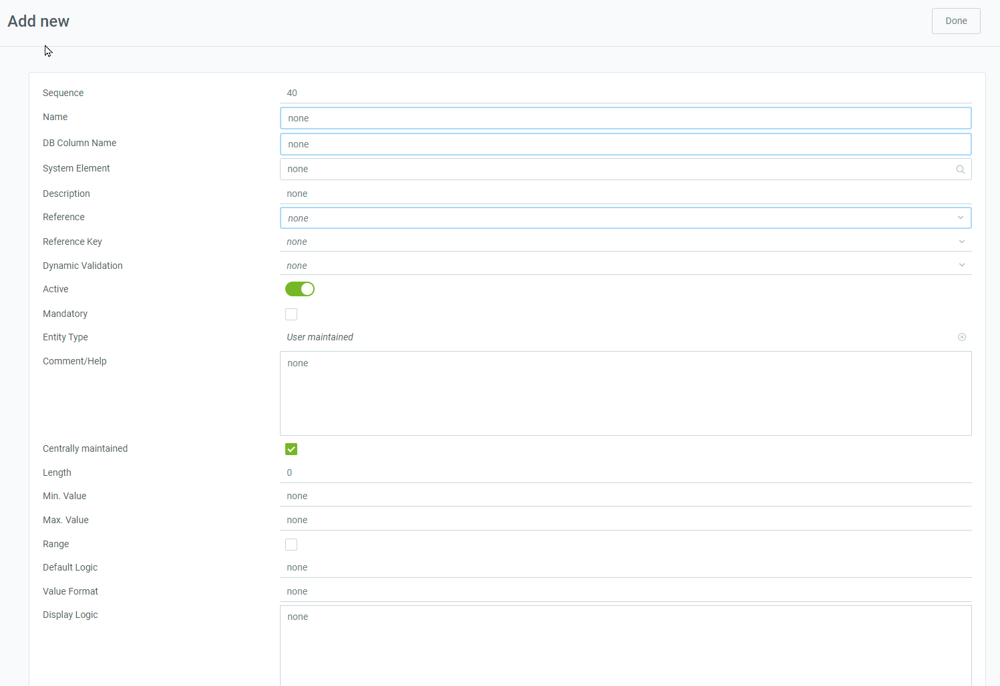</kbd>

Assigned to tables: Here you select the table in which your process should be available
the entity type must be the same as in your new process.

<kbd>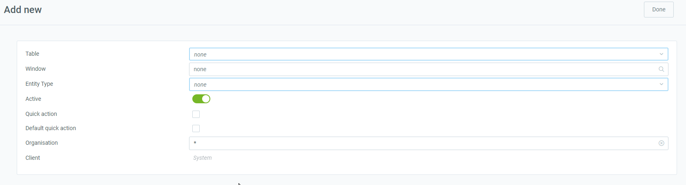</kbd>

#### The second way
You can use in X2Go.

Log in to the desired instance and select **System Administrator** as the role and as a client **system**.

<kbd>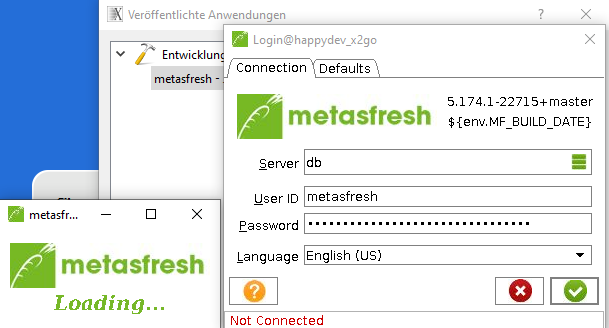</kbd>
<kbd></kbd>

Now click report & process

<kbd>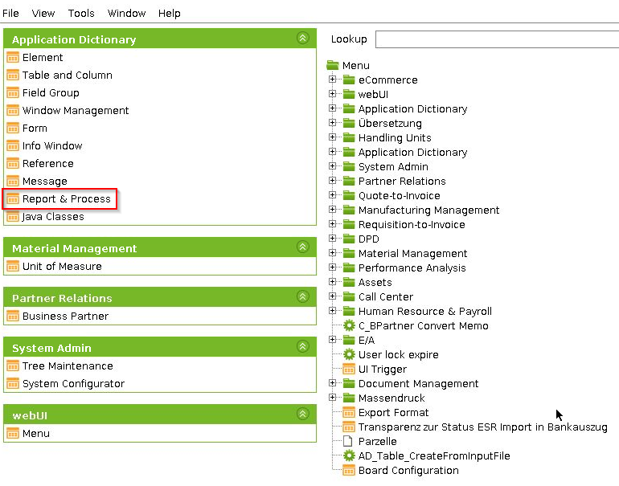</kbd>

Create a new process

<kbd>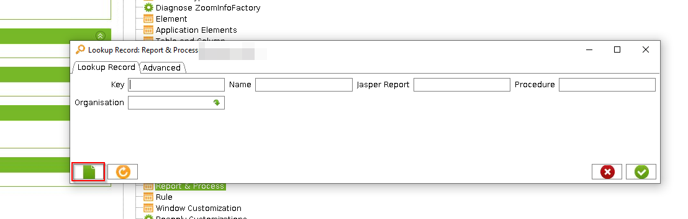</kbd>

<kbd>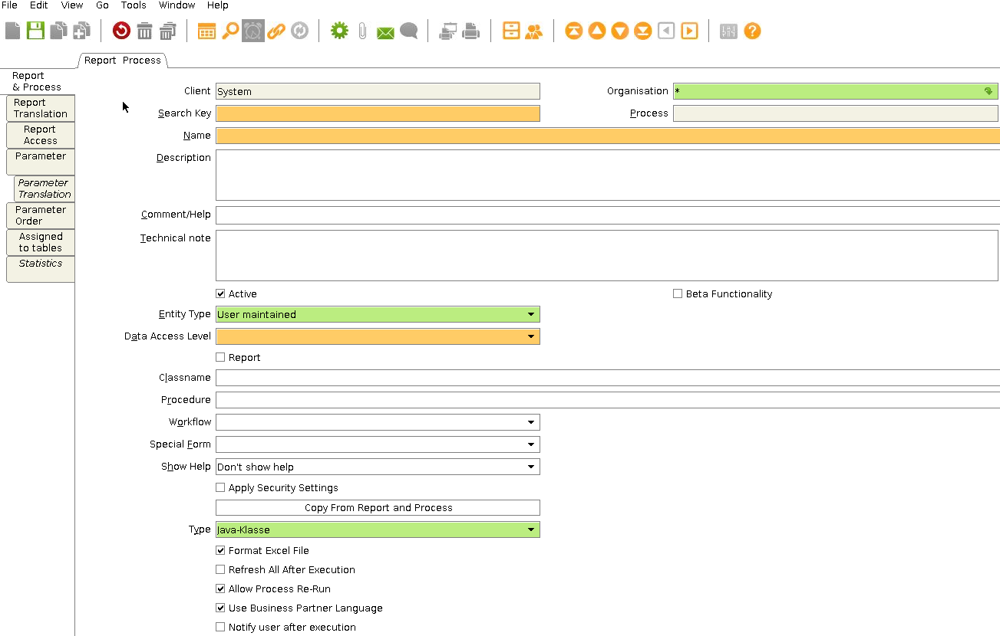</kbd>
