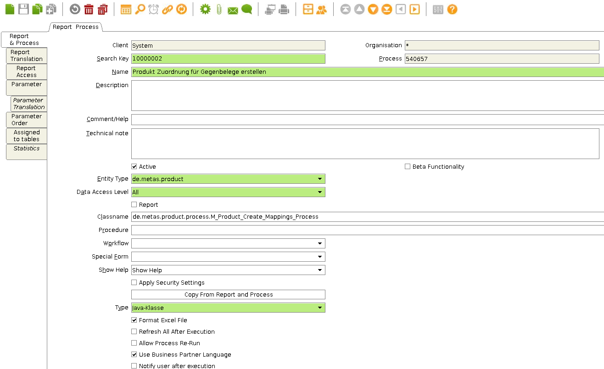
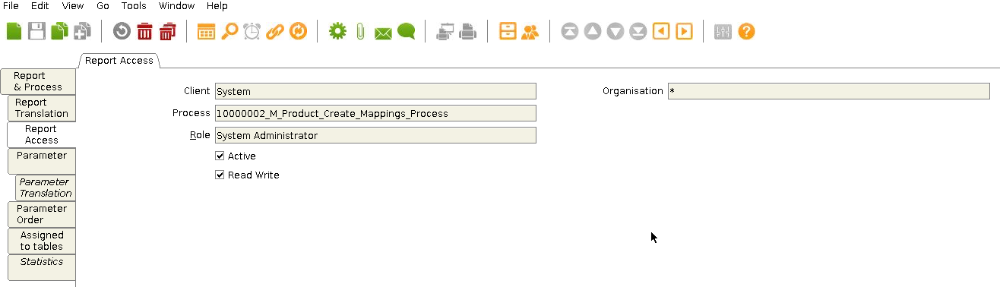
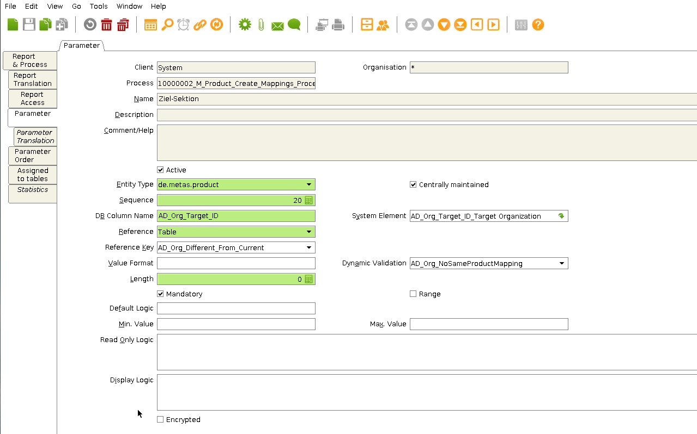
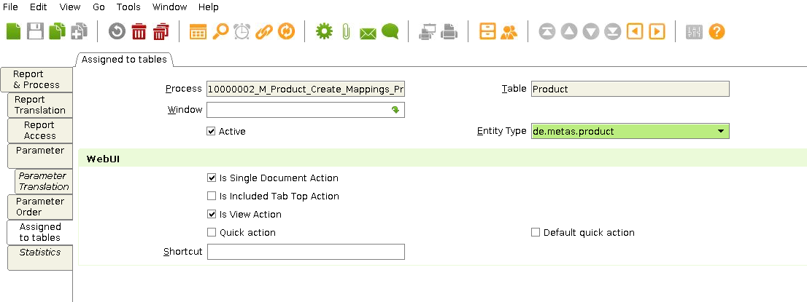
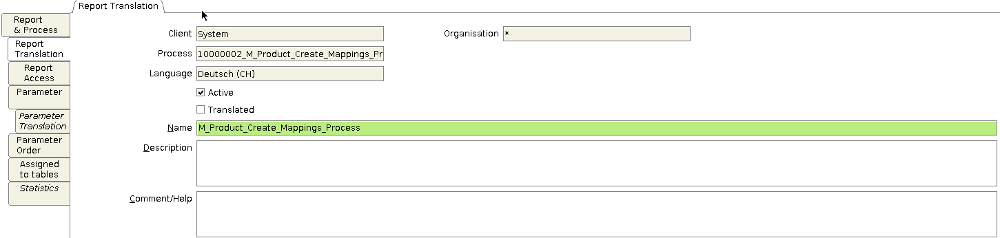
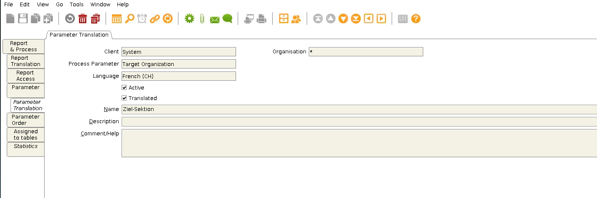

## Steps

#### Login in Java client
1. Log in to the desired instance and login as System Administrator.
2. Now go on report & process.
3. Create a new process.

<kbd></kbd>
### Setup the process

1. Search Key: Is the internal search name and must be unique.
1. Name: It is the name they are displayed in the action menu.
1. Active: Must be on if the process is to be displayed.
1. Entity Type: Dictionary entry type: Determines ownership and synchronization.
1. Data Access Level: Specifies who has access to this process and who can use it.
1. Type: Validation of the type of process.

<kbd></kbd>
### In Report Access
Here you enter the access rights for the roles.

<kbd></kbd>

### Parameters
To add a parameters click `add new` and the advanced edit with the following parameters will open up.
In this advanced edit you can enter:
1. *Sequence*: The way all parameters are ordered (usually in steps like 10,20,30,...)
1. *Name*, *Description*, *Comment/Help*: Contain information and help about the parameter needed to enter. The name and description are visible to the user.
1. *DB Column Name*: Defines how the column is named
1. *System Element*: The system element can be selected from the already existing system elements and also prefills Name, DB Column Name, Description and Comment.
1. *Reference*, *Reference Key*: Show the Type of parameter and optionally a Key if the data is in a table or list.
1. **Further options**
  1. *Mandatory*: If the box is checked, the user must enter information and cannot leave it blank
  1. *Entity Type*: Shows what Entity Type the parameter is
  1. *Default Logic*: What value should be selected as default, see: [Provide the result of an SQL as process to the user](configure_sql_process)

<kbd></kbd>

### Assigned to tables
1. Process: Designation of the process.
1. Table: The table to which the process is applied.
1. Entity Type: Dictionary entry type: Determines ownership and synchronization.

<kbd></kbd>

---
## **Optional Translations**

### If you still want to do translations
1. you have to open tools.
1. put a tick in **show Translation Tabs**

<kbd></kbd>

3. Then restarted your Java client.
1. Now in **report & processes** the **translation tabs** should be visible.

<kbd></kbd>
<kbd></kbd>
