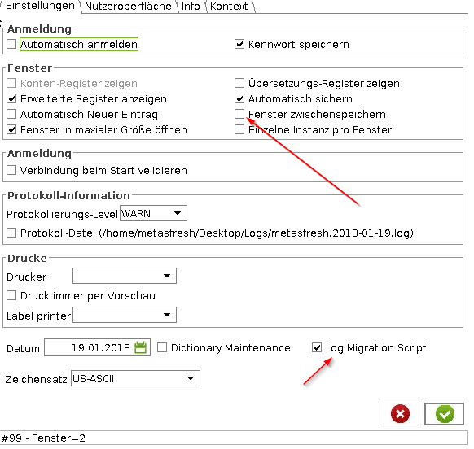

## Overview
This guide shows you how to activate migration script logging.

| **Important:** |
| :- |
| You need to have an ID server configured for this to work! If no ID server is configured in "System Config" then you will not see the checkbox. |

## Steps
1. Log in to the java back end with role "System Administrator".
1. Go to settings.
1. Make sure "Log migration script" is ticked.
1. Make sure "Cache Windows" is **NOT** ticked.<br><br> 
1. Open window "System Config".
1. Search for the name DICTIONARY_ID_COMMENTS.
1. In the field **Value** enter the label you want to log together with your changes later in the migration script, e.g., "Github Issue 123".
1. Change something like, e.g., the name of a window.
1. Go back to the settings.
1. Hover over the "logged migration scripts" checkbox to see the path where the scripts are stored. Should be something like `<your metasfresh client folder>/migration_scripts`.
1. Go to the path and open the script folder.
1. You see your change in the form of an SQL statement together with your custom label, e.g., "Github issue 123".

```
-- 2018-01-19T16:51:23.062
-- Github Issue 123
UPDATE AD_Window SET Name='Auftrag test',Updated=TO_TIMESTAMP('2018-01-19 16:51:23','YYYY-MM-DD HH24:MI:SS'),UpdatedBy=100 WHERE AD_Window_ID=143
;
```
