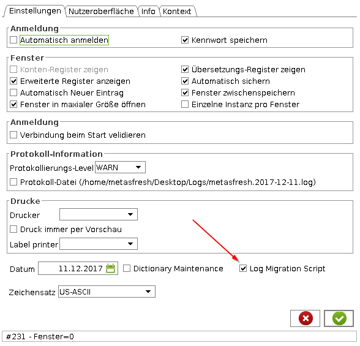

## Overview

This guide shows you how to activate migration script logging.

**Important:** you need to have an id server configured for this to be working! If no ID server is configured in System Config then you will not see the checkbox.

## Steps

1. login to the java backend
1. go to settings via menu
1. make sure "Log migration script" is ticked

1. you find the logged migration scripts by hovering over the checkbox
