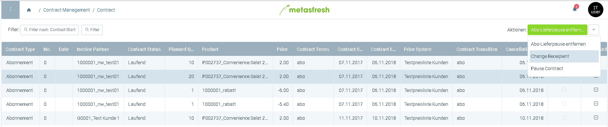

## Overview

This guide shows you how to configure a process to be shown in the quickaction drop down menu

## Steps

1. login to the java backend
1. open "window management"
1. search for the window where you want to show the process
1. go to first tab
1. zoom into field table to window "Table and Columns"
1. go to tab "assigned processes"
1. look for the process you want to configure
1. set checkbox *Quickaction* if you want to show it as quickaction
1. set checkbox *Default Quickaction* if you want this very quickaction to be preset when opnening the window
