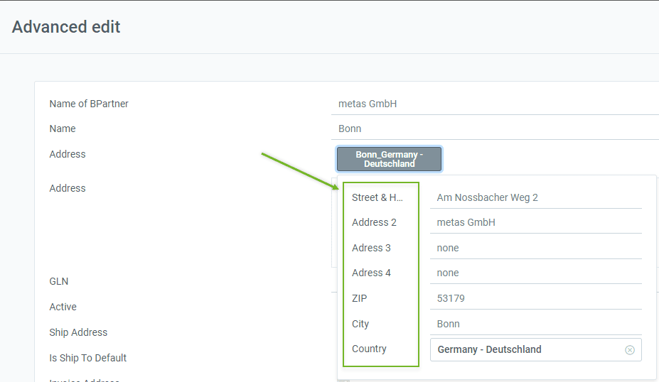
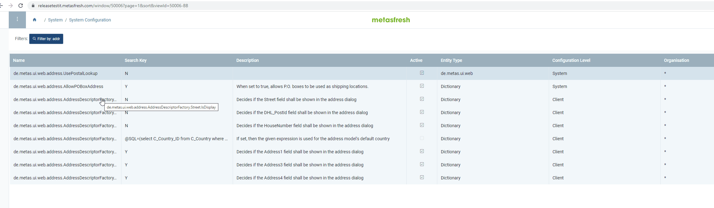
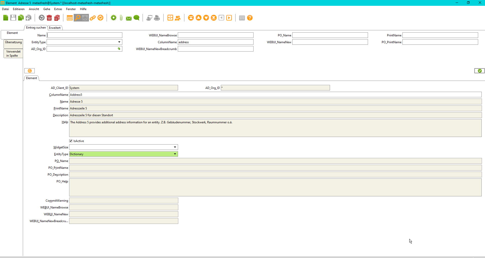
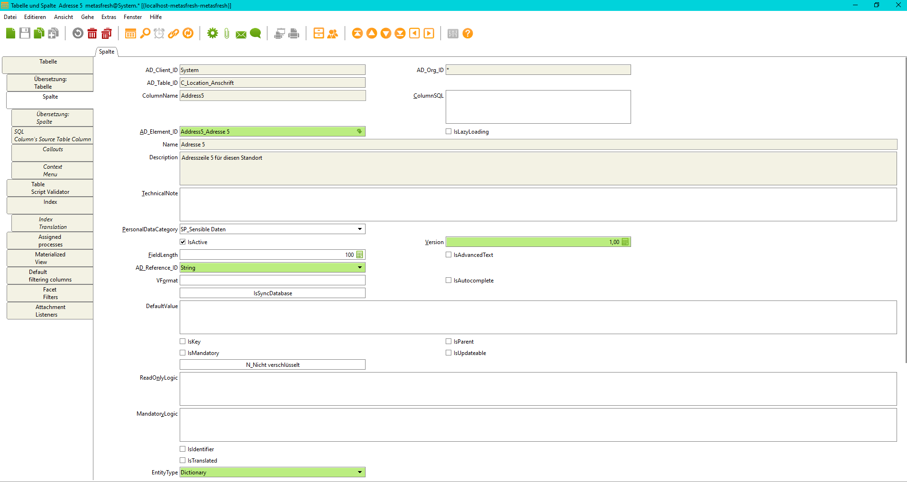
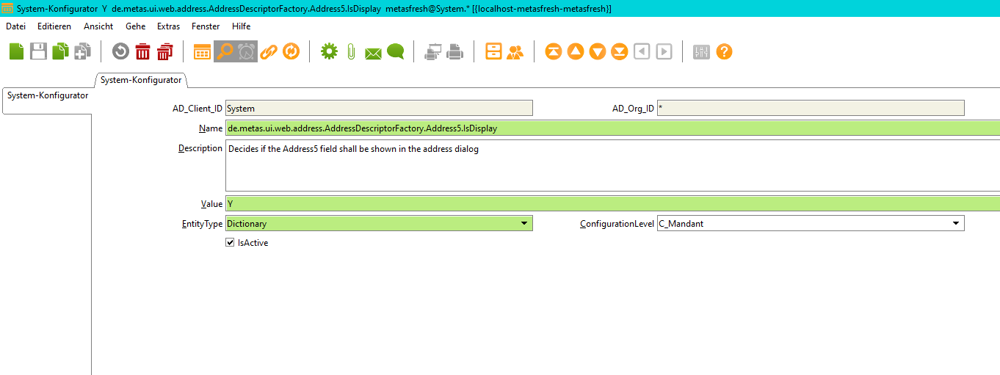
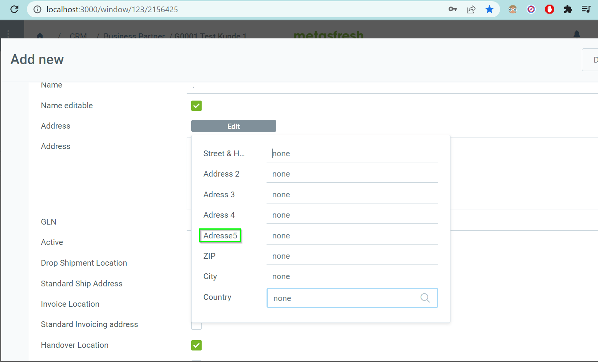

## Overview
In the [WebUI of metasfresh](https://docs.metasfresh.org/pages/webui/index_en), [addresses of business partners](../../webui_collection/EN/Add_address_tab) can be recorded in the record tab "Location" at the bottom of each entry in the "[Business Partner](../../webui_collection/EN/Menu)" window.

<kbd><a href="assets/webUI_bpartner_location_tab.png" title="Click to enlarge"></a></kbd>

This system configuration allows you to control which address fields are shown in the address modal overlay.

<kbd><a href="assets/webUI_bpartner_address_fields_modal_overlay.png" title="Click to enlarge"></a></kbd>

## Example

### Code reference
The following code reference will help you locate the related system configuration entries:
`de.metas.ui.web.address.AddressDescriptorFactory#SYSCONFIG_PREFIX`

### Configuration via WebUI
1. [Log in to metasfresh](../../webui_collection/EN/Login) with the [user role](../../webui_collection/EN/NewUserRole) "System Administrator".
1. Open "System Configuration" from the [menu](../../webui_collection/EN/Menu).
1. [Use the filter](../../webui_collection/EN/Filtering_function) to find the address configuration entries you want to adjust, e.g., by searching for "address".

<kbd><a href="assets/webUI_window_system_configuration_address_configs.png" title="Click to enlarge"></a></kbd>

### Configuration via SQL
The SQL to find the `sysconfig` entries is:

```SQL
select name,value from ad_Sysconfig where name like 'de.metas.ui.web.address.AddressDescriptorFactory%.IsDisplay';
```

The following SQL select statement will return the german translations of the queried address fields:

```SQL
select e.ad_element_id, ad_language,columnname,e.name,e.printname, etrl.name,etrl.printname  from ad_element e
join ad_element_trl etrl on etrl.ad_element_id = e.ad_element_id
where columnname ilike 'address%'
and ad_language='de_DE'
order by ad_language,e.name;
```

## Adding a new address field

- To add a new address field in this example `address5` is our new address field, first you need to add a new entry into `ad_element`:

<kbd><a href="assets/ad_element_address5_swing.png" title="ad_element address5 swingUI"></a></kbd>

- You also need to add a new column in `c_location`:

<kbd><a href="assets/c_location_table_address5_swing.png" title="column in c_location table"></a></kbd>

- Next you would need to add a new configuration into `ad_sysconfig`:

<kbd><a href="assets/sysconfig_address5_isdisplay_swing.png" title="sysconfig address 5 isdisplay"></a></kbd>

- After that you can run `Generate Model` to create the models for the `I_C_Location` and `X_C_Location`.

- Afterwards relocate to `de.metas.ui.web.address.AddressDescriptorFactory#createAddressEntityDescriptor` and add this to the function:

```java
addressDescriptor.addField(buildFieldDescriptor(IAddressModel.COLUMNNAME_Address5)
										   .setValueClass(String.class)
										   .setWidgetType(DocumentFieldWidgetType.Text)
										   .setDisplayLogic(getSysConfigDisplayValue(IAddressModel.COLUMNNAME_Address5))
										   .setDataBinding(new AddressFieldBinding(IAddressModel.COLUMNNAME_Address5, false, I_C_Location::getAddress5, AddressFieldBinding::writeValue_Address4)));

```

- Than go to `de.metas.ui.web.address.IAddressModel#IAddressModel` and insert this code:

```java
//@formatter:off
	String COLUMNNAME_Address5 = "Address5";
	String getAddress5();
	void setAddress5(String address);
	//@formatter:on
```

- when every step is completed, the results should look like this:

<kbd><a href="assets/local_address5.png" title="address5 field local WebUI"></a></kbd>
