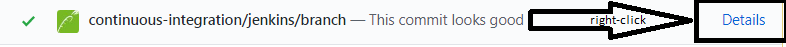
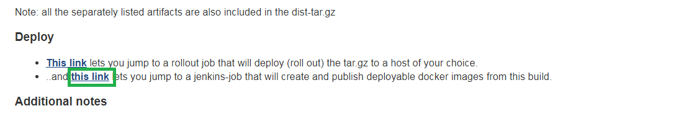
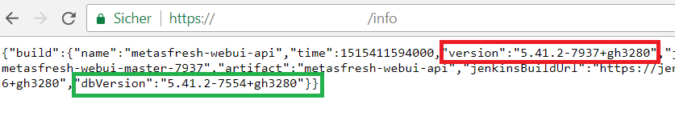

## Steps
1. Select the task you want to test. The task has to be in **review** and **must not** be integrated in master yet!
1. Open the GitHub issue for your task and check the pull requests. The issue must have **at least 1 pull request**.

   

1. Click the tab "Pull requests", and make sure that the branch has no conflicts with the base branch. It should say it somewhere at the bottom of the page.

   

1. Right-click the link to the jenkins page.

   

1. Look for the link to the dist build in the console where it should say `[metasfresh_dist] Starting building:...` somewhere towards the end. The link after that is the one you need.

   

1. Use this link to get to the build in metasfresh.dist where you want to perform the test:
	- =>  copy the tag/name of the version

1. Click the **second link** to create the build.

   

1. Enter your email address to be informed by email when the instance was built.
1. You will receive an email with the link to your testing docker environment with the respective username and password.
1. Click and open the link from the email. The login screen for your testing environment opens up.
1. Check the database version (`dbVersion`) to make sure the correct one was built. The database version shall be the same as the one in tag/name of the version you copied earlier.
   
