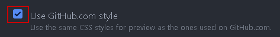

## Install

Download Atom from the <a href="https://atom.io/" title="atom.io" target="\_blank">official website</a>.

## Configuration

### Autocomplete Paths
With this you can easily create links to other markdown files without having to search them.

1. Press `Ctrl`/`⌘ cmd` + `⇧ Shift` + `P` to open the search.
1. Search for "Install Packages and Themes".
1. Click on `Settings View: Install Packages and Themes`.
1. Search for "autocomplete-paths".
1. Click on "Install".

**Usage:** Just enter "`/`" and then a part of the file you are looking for, e.g., `/sales` will suggest `SalesOrder_recording`.
  >**Hint:** Combine with Markdown Snippets using `l` + `TAB` to get ``.

### Markdown Image Helper

This package allows you to easily upload and insert images into markdown pages.

1. Press `Ctrl`/`⌘ cmd` + `⇧ Shift` + `P` to open the search.
1. Search for "Install Packages and Themes".
1. Click on `Settings View: Install Packages and Themes`.
1. Search for "markdown-image-helper".
1. Click on "Install".

### Enable GitHub Style

This setting switches the markdown preview to GitHub style.

1. Press `Ctrl`/`⌘ cmd` + `⇧ Shift` + `P` to open the search.
1. Search for "Installed Packages".
1. Click on `Settings View: View Installed Packages`.
1. Search for "markdown-preview".
1. Click on "Settings".
1. Enable "Use GitHub.com" style.

    <kbd></kbd>

### Make Markdown Preview scroll with the text

This Package automatically scrolls the markdown preview to the position of your cursor in the markdown text.

1. Press `Ctrl`/`⌘ cmd` + `⇧ Shift` + `P` to open the search.
1. Search for "Install Packages and Themes".
1. Click on `Settings View: Install Packages and Themes`.
1. Search for "markdown-scroll-sync".
1. Click on "Install".

## Format Snippets

Type the trigger and then press `TAB`.

| Trigger | Function |
| :--- | :--- |
| b | **bold text** |
| code | `code` |
| i | *italic* |
| img | embedded image |
| l |	link |
| table |	table |

## Text Snippets
You can edit snippets via the menu bar by going to **File** > **Snippets...**

You can find the <a href="https://github.com/metasfresh/metasfresh-documentation/blob/gh-pages/ressources/snippets.cson" title="Latest markdown snippets" target="\_blank">latest snippets here</a>.

## Shortcuts

1. Use `Ctrl`/`⌘ cmd` + `⇧ Shift` + `M` for markdown preview.
1. Use `Ctrl`/`⌘ cmd` + `V` to paste an image from the clipboard.
  >**Note:** Images are stored in the subfolder `/assets`.

1. Use `img` + `TAB`, click into `()` and then press `Ctrl`/`⌘ cmd` + `V` to paste an image link.

## General Background Info

### Other Markdown Editors

If you install other packages that support markdown, the image helper will stop working if the language of the document is not "GitHub Markdown".

Make sure the core package "language-gfm" is enabled (gfm = github flavored markdown).

### User settings

Atom stores your settings and packages here: `%userprofile%\.atom`.
