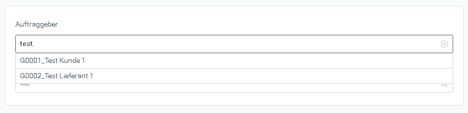
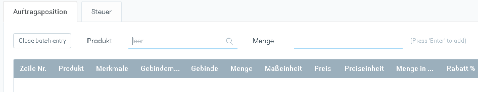
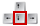
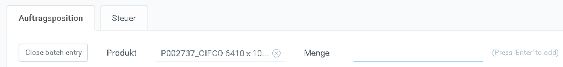
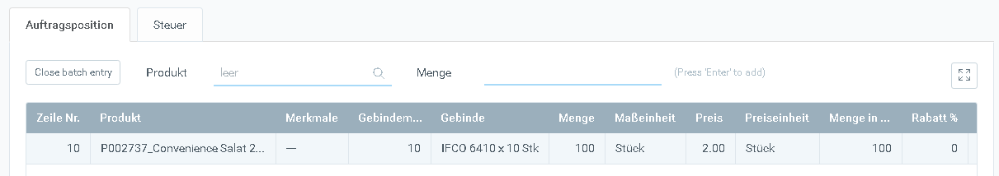
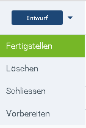
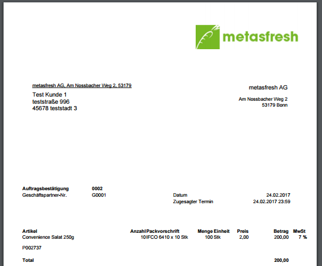

## Video

<iframe src="https://player.vimeo.com/video/206308809" width="640" height="325" frameborder="0" webkitallowfullscreen mozallowfullscreen allowfullscreen></iframe>

## Detailbeschreibung
1. [Neuen Datensatz anlegen](Neuer_Datensatz_Fenster_Webui)

1. Gib einen Teil des Kundennamens oder der Kundennummer ein. z.B. "test" ein und klicke auf "Testkunde"

1. Klicke auf "Batch Entry" oder drücke die Tastenkombination `Strg+Q` um eine Auftrgszeile zu erfassen

1. Gib einen Teil des Produktnamens oder der Produktnummer ein (z.B. "conv") und klicke auf den Vorschlag "Convenience Salat" oder drücke die Pfeiltaste  und dann `Enter`

1. Klicke in das Feld **Menge** oder Drücke die `TAB` Taste um dorthin zu wechseln

1. Gib eine Menge ein

1. Drücke `Enter` um die Auftragszeile zu erstellen

1. Drücke `Strg+I` um die Belegverarbeitung zu öffnen  

1. Drücke `Enter` um den Auftrag fertigzustellen  

1. Drücke `Strg+P` oder `Strg+1` und klicke auf "Print" um die Auftragsbestätigung zu öffnen  

