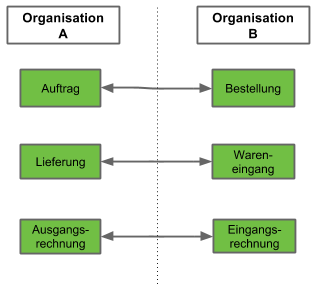
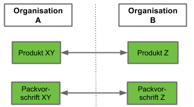

## Übersicht

metasfresh ermöglicht Dir nicht nur die Verwaltung mehreren juristischer Personen in einem System mittels Organisationen, sondern auch die jeweiligen Gegenbelege automatisch zu erzeugen wenn diese Organisationen miteinander Geschäfte abwickeln.

So wird z.B. ein Auftrag an Organisation B durch Org. A automatisch zu einer Bestellung in Org, B des Kunden Org. A. 

Damit nicht beide Organisation die identischen Produkte und Packmittel führen müssen, kannst Du die jeweiligen passenden Stammdaten miteinander verbinden.

 

## Verwaltung

1. [Wie konfiguriere ich die Gegenbelegerstellung für eine Belegart ?](Wie_konfiguriere_ich_die_Gegenbelegerstellung_für_eine_Belegart)
1. [Wie ordne ich zwei Produkte einander zu zwecks Gelegenbelegerstellung?](Wie_ordne_ich_zwei_Produkte_einander_zu_zwecks_Gelegenbelegerstellung)
1. [Wie kann ich bestehende Produktzuordnungen für die Gegenbelegerstellung einsehen ?](Wie_kann_ich_bestehende_Produktzuordnungen_für_die_Gegenbelegerstellung_einsehen)
1. [Wie entferne ich die Zuordnung zwischen zwei Produkten (Gelegenbelegerstellung) ?](Wie_entferne_ich_die_Zuordnung_zwischen_zwei_Produkten_Gelegenbelegerstellung)

## Beispiel Ablauf

1. Benutzer der Org A stellt Auftrag an Org B fertig
2. Automatisch wird in Org B eine Bestellung erzeugt mit Org A als Lieferant und mit den jeweils zugehörigen Produkten und Packvorschriften 
3. Die Bestellung in Org B bleibt erst einmal offen damit Du noch eine Sichtprüfung machen kannst

## Kontrolle

1. Einmal pro Tag versendet metasfresh eine Liste der Gegenbelege die erstellt wurden
1. Sollte einmal ein Gegenbeleg nicht erstellt werden können weil z.B. verknüpfte Stammdaten nicht angelegt wurden, erhält Du eine entsprechende Fehlermeldung per mail
1. Im Fenster Missing Counter Documents findest Du die Belege aufgelistet die nicht erstellt werden konnten 

