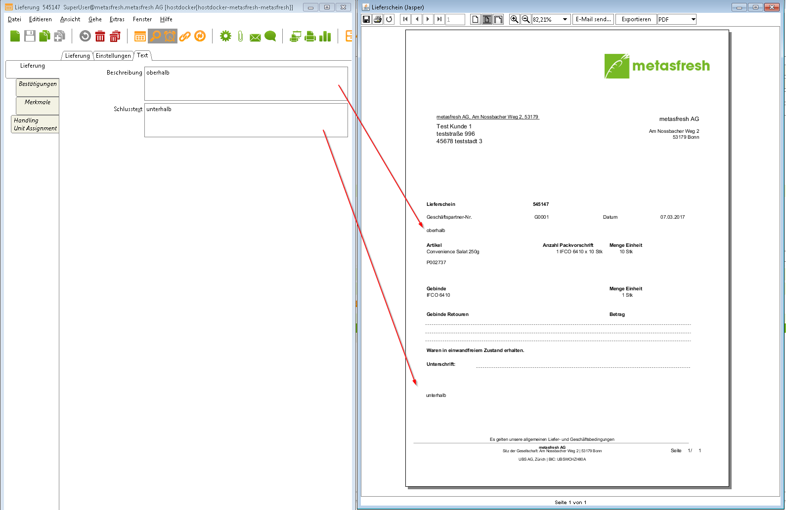

## Schritte

1. Öffne das Fenster "Lieferung"
1. Klicke in das Tab "texte"
1. Feld **Beschreibung** enthält den Text oberhalb der Lieferscheinzeilen
1. Feld **Schlusstext** enthält den Text unterhalb der Lieferscheinzeilen

