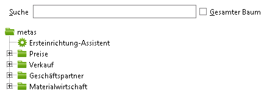

## Suchfunktion nutzen
1. An metasfresh anmelden
1. Im Hauptmenü im Feld **Suche** einen Teil oder den ganzen Fensternamen eingeben 
	* z.B. "partner"
1. Taste ENTER drücken
	* metasfresh sprint zum ersten Fenster dessen Namen "partner" enthält
1. Das Fenster durch Klicken öffnen (Alternativ: STRG + ENTER)
