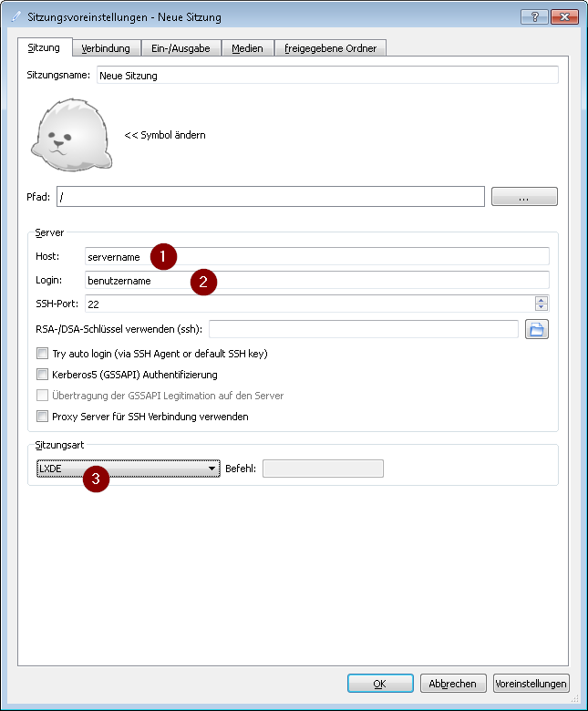

Wenn Du metasfresh nutzen möchtest ohne dass der Server in Deinem Netzwerk ist, dann verwende einen Terminaldienst wie z.B. x2Go.

So greifst Du mit Deinem Client auf einen x2Go Server zu:

1. Lade Dir von [dieser Seite](http://wiki.x2go.org/doku.php/download:start) die passende Version für Dein Betriebssystem herunter 
1. Nach der Installation Starte x2go
1. Drücke die Tastenkombination STRG + N um eine neue Verbindung anzulegen
   1. Host: *servernamen*
   1. Login: *Benutzernamen*
   1. Sitzungsart: wähle LXDE aus 
1. Drücke OK um die Sitzung zu speichern
1. Klicke rechts auf die Verbindung um eine Sitzung zu starten

