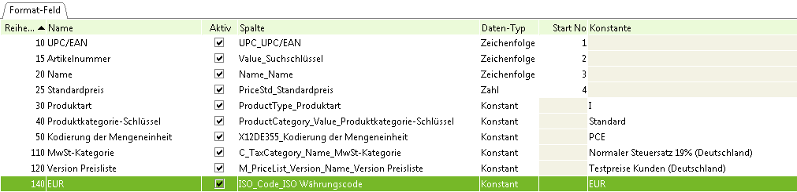

## Schritte

1. [Import-Format "Mein Produktimport" erstellen](Wie_definiere_ich_ein_Importformat) 
1. [Importdatei erstellen](Wie_erstelle_ich_eine_Importdatei)
1. [CSV-Datei importieren](Wie_importiere_ich_eine_CSV_Datei)


## Beispiel

CSV Datei mit Tab:

```
4000	artikelname	I	Standard	PCE	Testpreise Kunden (Deutschland)	123	Normaler Steuersatz 19% (Deutschland)
```


Import Format:

