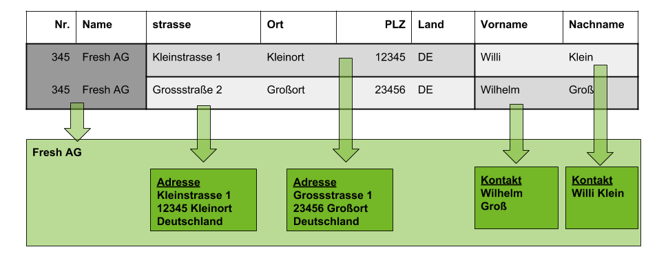

## Beispiel

Hier findest Du ein Beispiel wie eine CSV Datei aufgebaut werden muss um mehrere Adressen und Kontakte zu einem Partner zu importieren:

## Weitere Infos

[Wie importiere ich Kunden und Lieferanten via CSV Datei ?](Wie_importiere_ich_Kunden_und_Lieferanten_via_CSV_Datei)
 
