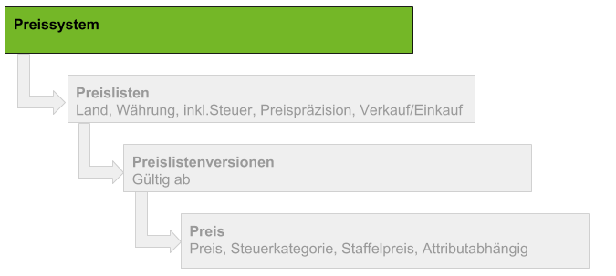

## Übersicht

Ein Preissystem enthält ein oder mehrere Länderpreislisten um diese einem Kunden / Lieferant oder einer Partnergruppe zuzuordnen. 
Weitere Details findest Du hier: 

[Worin unterscheiden sich Preissystem und Preisliste ?](Worin_unterscheiden_sich_preissystem_und_preisliste)

## Schritte

1. [Fenster "Preise" öffnen](Wie_finde_und_öffne_ich_ein_Fenster) 
1. [Neuen Datensatz anlegen](Wie_lege_ich_einen_neuen_datensatz_an)
1. Feld **Name** ausfüllen	
1. [Speichern](Wie_lege_ich_einen_neuen_datensatz_an)

## Wie geht es weiter?

[Wie lege ich eine Preisliste an ?](Wie_lege_ich_eine_Preisliste_an)