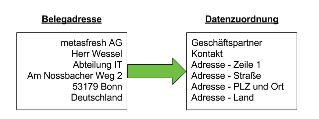

## Übersicht

Die Adresse auf Belegen wie Auftragsbestätigung, Lieferschein, Rechnung, etc. setzt sich in metasfresh aus verschiedenen Daten zusammen.

Hier siehst Du an einem Beispiel woraus sich eine Belegadresse zusammensetzt:

|  Belegadresse       | Quelle                   | Wo zu finden?                                                                                  |
| ------------------- | ------------------------ | ---------------------------------------------------------------------------------------------- |
| metasfresh AG       | Geschäftspartner         | Fenster Geschäftspartner => Feld Name                                                          |
| Herr Norbert Wessel | Kontakt                  | Fenster **Geschäftspartner**, Register **Kontakt**, Felder **Anrede**,**Name**                 |
| Abteilung IT        | Adresse  - Adresszeile 1 | Fenster **Geschäftspartner**, Register **Adresse**, Button **Adresse**, Feld **Adresszeile 1** |
| Am Nossbacher Weg 2 | Adresse - Straße         | Fenster **Geschäftspartner**, Register **Adresse**, Button **Adresse**, Feld **Straße**        |
| 53179 Bonn          | Adresse - PLZ und Ort    | Fenster **Geschäftspartner**, Register **Adresse**, Button **Adresse**, Feld **PLZ und Ort**   |
| Deutschland         | Adresse - Land           | Fenster **Geschäftspartner**, Register **Adresse**, Button **Adresse**, Feld **Land**          |

## Nächste Schritte

Wie kann ich die Generierung der Belegadresse konfigurieren?

