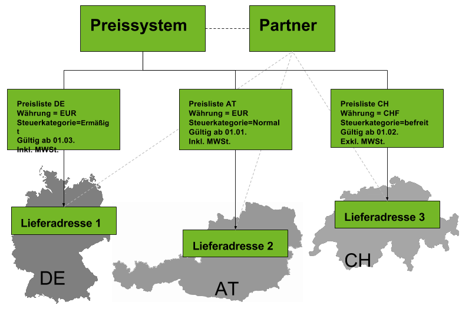

## Übersicht

Das Preissystem fasst verschiedene Preislisten die wiederum Länder- und Währungsspezifisch sein können zusammen, um sie einem Partner (Kunde/Lieferant) oder einer Partnergruppe zuordnen zu können.

