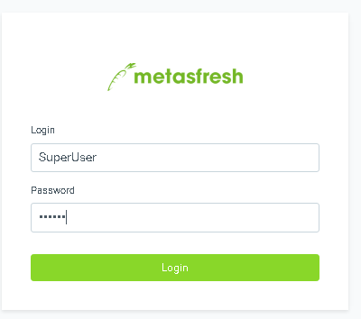
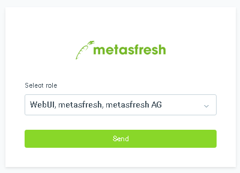
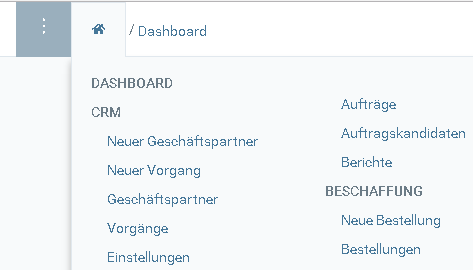
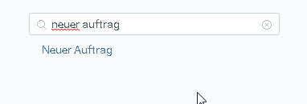

## Schritte

### Anmeldung

1. Öffne in Deinem Browser die URL von metasfresh. z.B. http://dockerhost
1. Melde Dich mit "SuperUser" und "System" an

 

1. Wähle die Rolle "WebUI" aus

 

### Auftrag

1. Drücke die Tastenkombination `Strg+2` um das Menü zu öffnen

 

1. Suche im Menü nach "Neuer Auftrag" und klicke auf den Link  

1. Gib "test" ein und klicke auf "Testkunde"

1. Drücke die Tastenkombination `Strg+Q` um eine Auftrgszeile zu erfassen

1. Gib "conv" ein, drücke die Pfeiltaste  und dann `Enter`

1. Drücke die `TAB` Taste um in das Feld Menge zu wechseln
1. Gib eine Menge ein

1. Drücke `Enter` um die Auftragszeile zu erstellen

1. Drücke `Strg+I` um die Belegverarbeitung zu öffnen  

1. Drücke `Enter` um den Auftrag fertigzustellen

### Lieferung

### Rechnung
