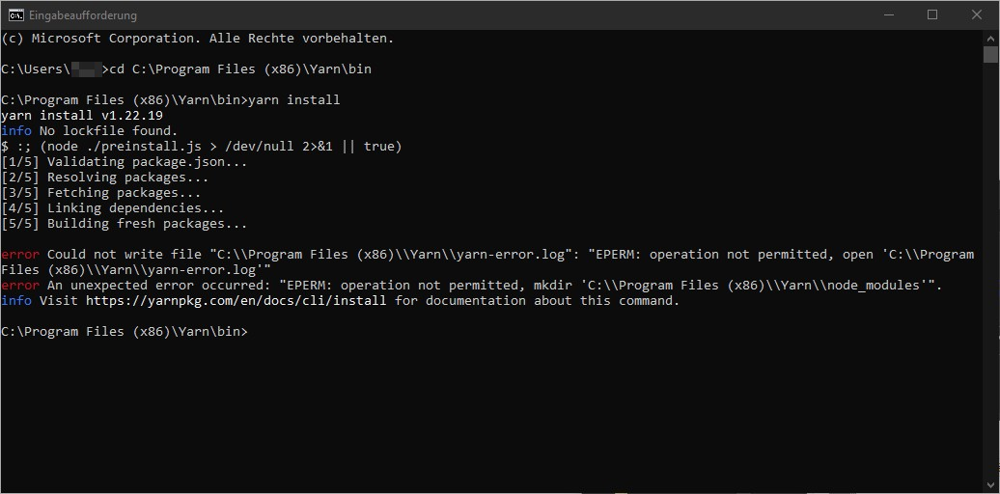
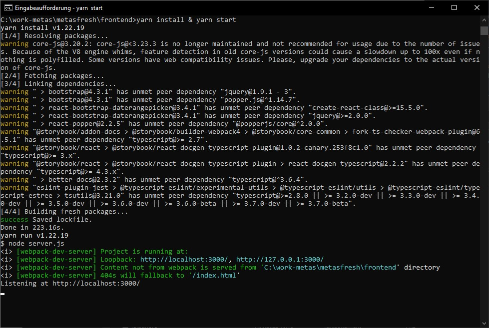

## Download and Install Yarn

- Go to https://classic.yarnpkg.com/lang/en/docs/install/#windows-stable and download the Yarn windows installer .msi file and follow the instructions in the Setup Wizard.

- Open the windows Command Prompt and locate the yarn folder or use this path: `C:\Program Files (x86)\Yarn\bin`.

- After locating the folder, run this command: `yarn install`.

<kbd></kbd>

## Using Yarn in metasfresh

- Open windows Command Prompt and navigate to the metasfresh frontend folder, in the example it would be this path: `C:\work-metas\metasfresh\frontend`.

- Than open IntelliJ, go to services and get  `ServerBoot` and `WebRestApiApplication` up and running.

- Than go back to Command Prompt and run this command : `yarn install & yarn start;`.

<kbd></kbd>

- In your Browser, go to `localhost:3000` that will be your local webUI.

<kbd></kbd>
