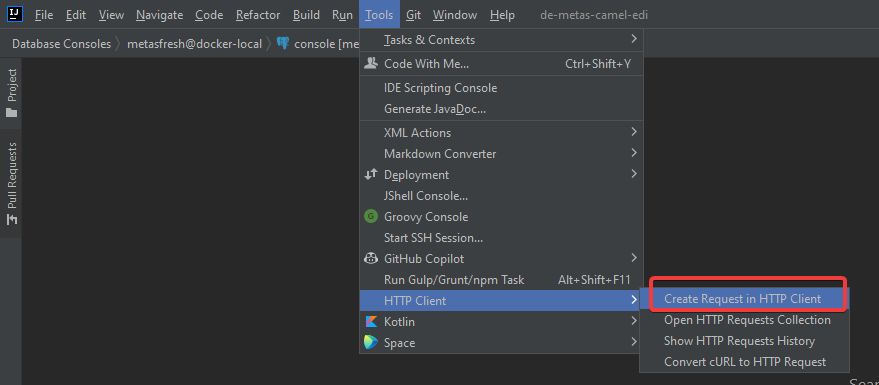
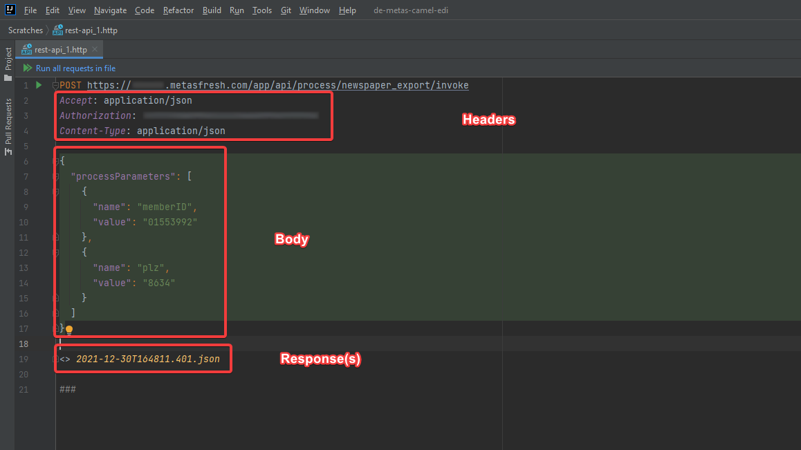
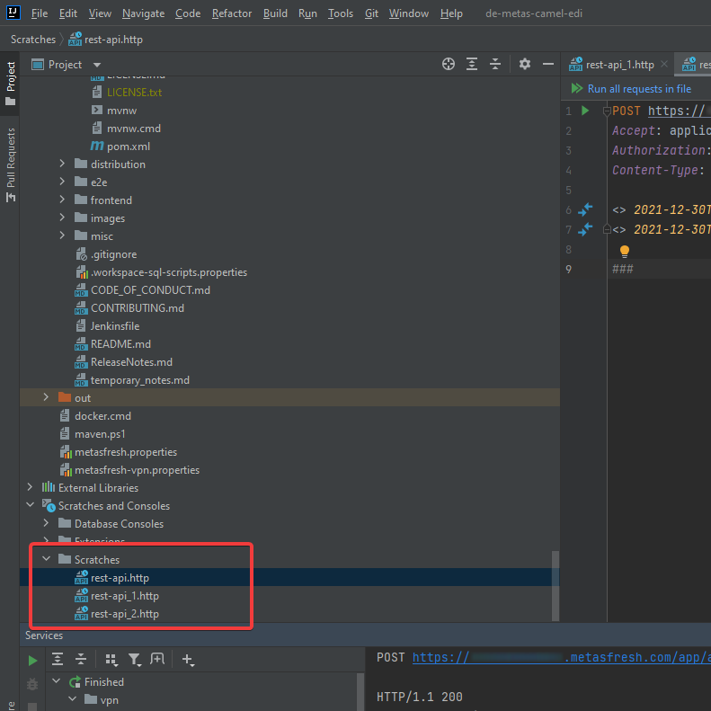
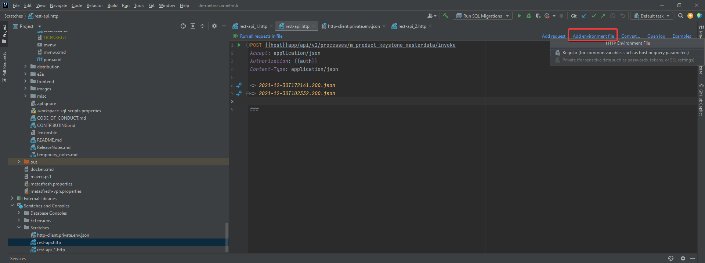
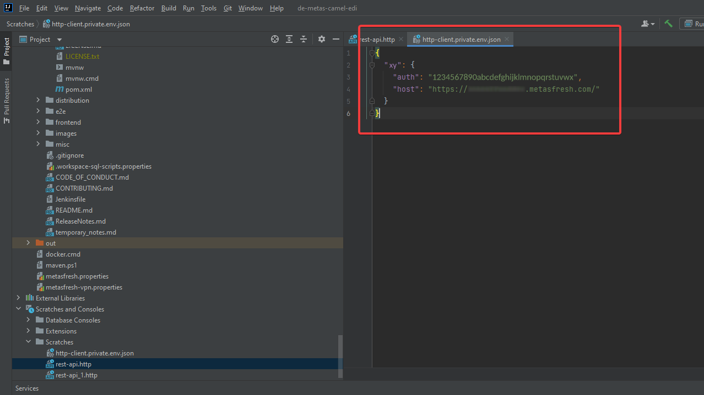
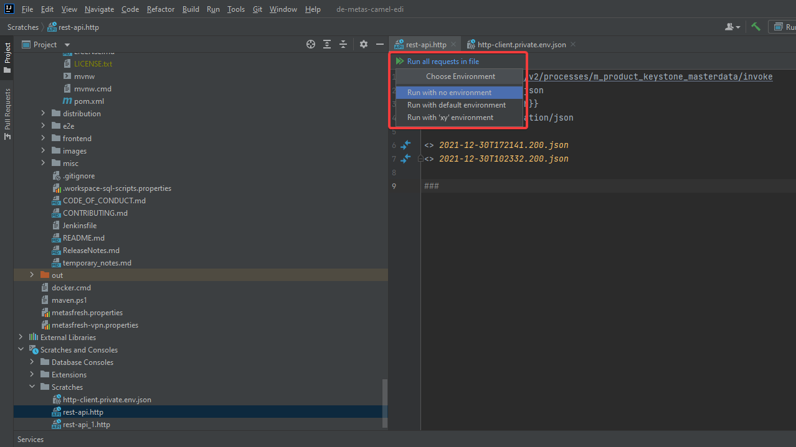

<!--
See original issue comment: https://github.com/metasfresh/me03/issues/9967#issuecomment-1003077013
-->

## Overview
This guide describes how to use IntelliJ for testing HTTP endpoints.

- The "HTTP Client" can be found under **Tools** in the menu bar:

    <kbd></kbd>

- A request would look like this:

    <kbd></kbd>

    - Each time a request is run, its results will be appended to the "Responses" section.

- Requests are stored under `Scratches and Consoles > Scratches`:

    <kbd></kbd>

## Using Placeholders in Environment Files
1. Create a new environment file.

    <kbd></kbd>

1. Fill the environment file with appropriate data.

    <kbd></kbd>

1. When running, choose which environment file to use.

    <kbd></kbd>
