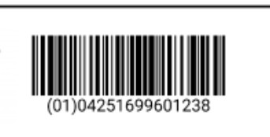

## Overview
Barcodes according to the <a href="https://www.gs1-128.info/" title="GS1-128 Barcodes &#124; gs1-128.info" target="\_blank">EAN-128/GS1-128</a> standard use a series of "<a href="https://www.gs1-128.info/application-identifiers/" title="Table of Application Identifier Values &#124; gs1-128.info" target="\_blank">Application Identifiers</a>" to include additional data such as best before dates, batch numbers, quantities, weights and many other attributes needed by the user. (Source: <a href="https://en.wikipedia.org/wiki/GS1-128" title="GS1-128" target="\_blank">wikipedia.org</a>)

Application identifiers precede the barcode serial number and are enclosed by group separators, such as round brackets `()`.

## Example
The following barcode example is made up of an application identifier `01` separated as a group by round brackets (`\u001D`) and followed by the serial number `04251699601238`:

<kbd></kbd>

The code behind this barcode looks like this:

```
<componentElement>
    <reportElement style="Barcode" x="567" y="11" width="132" height="34" uuid="b2179e7e-2c61-4447-acf7-bc189867f074">
        <property name="com.jaspersoft.studio.unit.width" value="px"/>
        <property name="com.jaspersoft.studio.unit.height" value="px"/>
        <property name="com.jaspersoft.studio.unit.x" value="px"/>
        <property name="com.jaspersoft.studio.unit.y" value="px"/>
    </reportElement>
    <jr:EAN128 xmlns:jr="http://jasperreports.sourceforge.net/jasperreports/components" xsi:schemaLocation="http://jasperreports.sourceforge.net/jasperreports/components http://jasperreports.sourceforge.net/xsd/components.xsd" moduleWidth="1.0">
        <jr:codeExpression><![CDATA[("0104251699601238\u001D"]]></jr:codeExpression>
    </jr:EAN128>
</componentElement>
```
