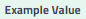
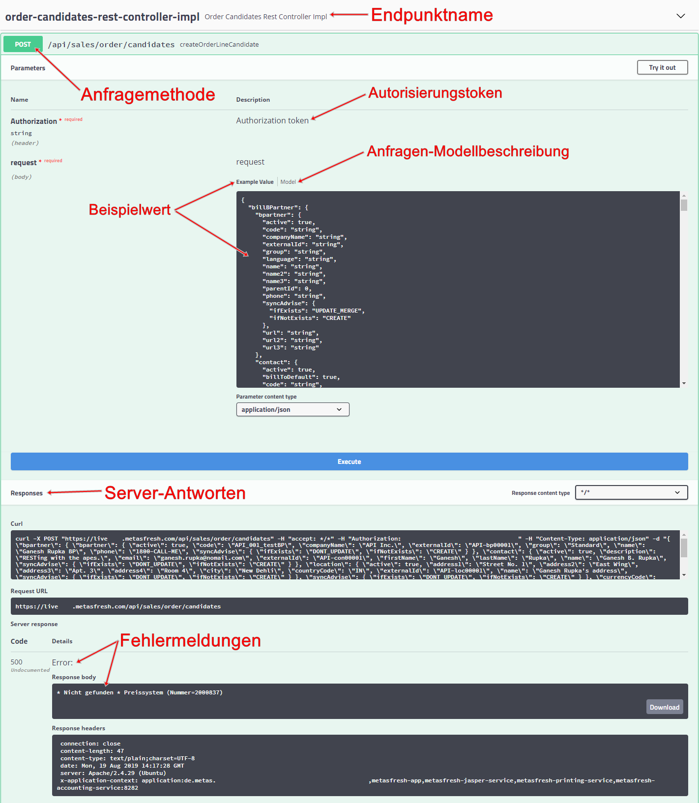

## Überblick
Über den metasfresh Webservice (REST API) kannst Du externe Daten nach metasfresh übertragen sowie bestehende Dateneinträge aus dem System abrufen, aktualisieren oder löschen. Dies erfolgt über sogenannte *API-Endpunkte*, wobei jeder Endpunkt für die Migration bestimmter Datensätze eingerichtet ist, die mittels Serveranfrage im <a href="https://www.json.org/json-de.html" title="Einführung in JSON" target="\_blank">JSON-Format</a> an den metasfresh Application Server übermittelt werden können.
Eine Besonderheit der metasfresh REST API ist, dass Du Datenmigrationen, die im Normalfall über die einzelnen Endpunkte erfolgen würden, ebenso gut in nur einer Serveranfrage zusammenfassen kannst, im Zuge dessen gleich mehrere Dateneinträge auf einmal angelegt werden. So lässt sich z.B. bei der Migration eines Auftragskandidaten in die Auftragsdisposition von metasfresh gleichzeitig ein neuer Geschäftspartner- und Produkteintrag anlegen.

Eine Vorlage für eine Serveranfrage im JSON-Format steht für jeden Endpunkt zur Verfügung und kann an der jeweiligen Stelle () eingesehen, kopiert und mit den gewünschten Daten ergänzt werden. Eine Beschreibung des Anfrage-Modells () mit Erläuterungen zu den einzelnen Elementen hilft Dir bei der Erstellung Deiner eigenen Serveranfrage.

Um den Webservice nutzen zu können, benötigst Du allerdings ein Autorisierungstoken, mit dem Du Dich erst gegenüber der REST API authentifizieren musst, bevor Du eine Serveranfrage absenden kannst. Dieses Token wird Dir in dem Eintrag Deines metasfresh-[Nutzers](../../webui_collection/DE/Nutzer_anlegen) bereitgestellt.

## Schritte
1. [Halte Dein Autorisierungstoken bereit](../../webui_collection/DE/Authentifizierungstoken).
1. Erlange Zugang zur metasfresh Application Server REST API.
 >**Hinweis:** Die URL setzt sich in der Regel folgendermaßen zusammen:<br> `https://instanzname###.metasfresh.com/app/swagger-ui/`

1. Öffne den Endpunkt, den Du zur Datenmigration verwenden möchtest, durch Anklicken des Endpunktnamens.
1. Klicke links unterhalb des Endpunktnamens auf die gewünschte <a href="https://wiki.selfhtml.org/wiki/HTTP/Anfragemethoden" title="HTTP-Anfragemethoden" target="\_blank">Anfragemethode</a>.
1. Klicke rechts unterhalb der Anfragemethode auf . Die Eingabefelder **Authorization token** und **request** werden editierbar.
1. Füge in das Feld **Authorization token** Dein Autorisierungstoken ein.
1. Füge in das Feld **request** Deine vorbereitete Serveranfrage im JSON-Format ein.
1. Klicke auf , um die Serveranfrage abzusenden.
 >**Hinweis:** Eventuelle Fehlermeldungen werden Dir unten im Abschnitt **Responses** angezeigt.

## Verfügbare Endpunkte
Im Folgenden werden die derzeit verfügbaren Endpunkte aufgeführt. Klicke auf einen Endpunkt, über den Du mehr erfahren möchtest.

- [Auftragskandidaten (Auftragsdisposition)](order-candidates-rest-controller-impl)
- Aufträge
- Dateiup- und -download
- Datenimport
- Geschäftspartner und Kontakte
- Produkte und Produktkategorien
- Rechnungen und Rechnungskandidaten

## JSON-Elemente

### externalId

```json
"externalId": "2156435"
```

Dieses Name-Wert-Paar bezieht sich auf die ID des Datensatzes auf der externen Plattform, von der die Daten abgerufen werden. Die `externalId` muss **eindeutig** sein. Zu finden ist sie am Ende der URL eines Dateneintrages in metasfresh hinter der Fenster-ID, wie in dem folgenden Beispiel zu erkennen ist:

<p style="margin-left:25%; width:50%; border:1px; border-style:solid; border-color:#dddddd; padding:0.5em; text-align:center;">https://<code>{{ Basis-URL }}</code>/window/123/<strong>2156435</strong></p>

### syncAdvise

```json
"syncAdvise": {
  "ifExists": "DONT_UPDATE",
  "ifNotExists": "CREATE"
}
```

Mithilfe dieses Objektes wird geprüft, ob ein Datensatz bereits existiert oder nicht sowie gesteuert, was in dem jeweiligen Fall passieren soll. Je nach Wertvorgabe können bestehende Datensätze aktualisiert, gelöscht oder von der Datenmigration ausgeschlossen sowie neue Datensätze angelegt oder der gesamte Migrationsvorgang abgebrochen werden.

| Kondition | Werte | Beschreibung |
| :--- | :--- |:--- |
| "ifExists" | •&nbsp;UPDATE_MERGE<br> •&nbsp;UPDATE_REMOVE<br> •&nbsp;DONT_UPDATE | Ist ein Datensatz bereits vorhanden, kann er aktualisiert, gelöscht oder ausgelassen werden. |
| "ifNotExists" | •&nbsp;CREATE<br> •&nbsp;FAIL | Ist ein Datensatz nicht vorhanden, kann er angelegt werden oder der Migrationsvorgang wird abgebrochen. |

## Beispiel

