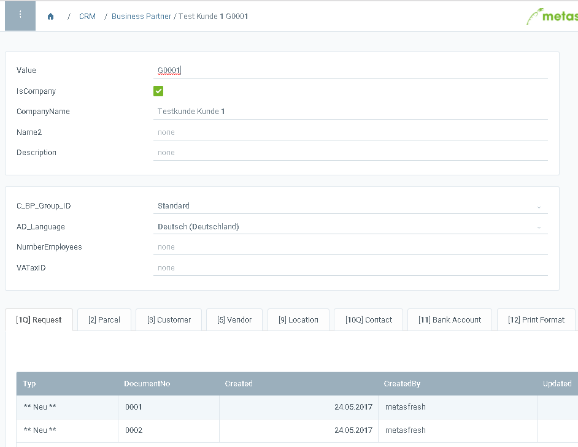

## Überblick
Wenn Du die Spalten hinter den Feldern (unabhängig von den Spracheinstellungen) und die ID der Registerkarten sehen möchtest, kannst Du die *Entwickleransicht* aktivieren.

## Schritte
1. [Öffne Swagger](REST_API_durchsuchen_mittels_Swagger).
1. Suche nach `/debug-rest-controller/setShowColumnNamesForCaptionUsingPUT`  oder rufe diese URL direkt auf  `https://<deinserver:port>/swagger-ui/index.html#/debug-rest-controller/setShowColumnNamesForCaptionUsingPUT`.
1. Gib den Sprachencode `true` in das Feld **adLanguage** ein.
1. Klicke auf "Try it out".
1. Aktualisiere die metasfresh WebUI-Browsersitzung, damit die Änderung wirksam wird.

## Beispiel

### Vor der Aktivierung der Entwickleransicht

<kbd></kbd>

### Nach der Aktivierung der Entwickleransicht

<kbd></kbd>
