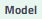
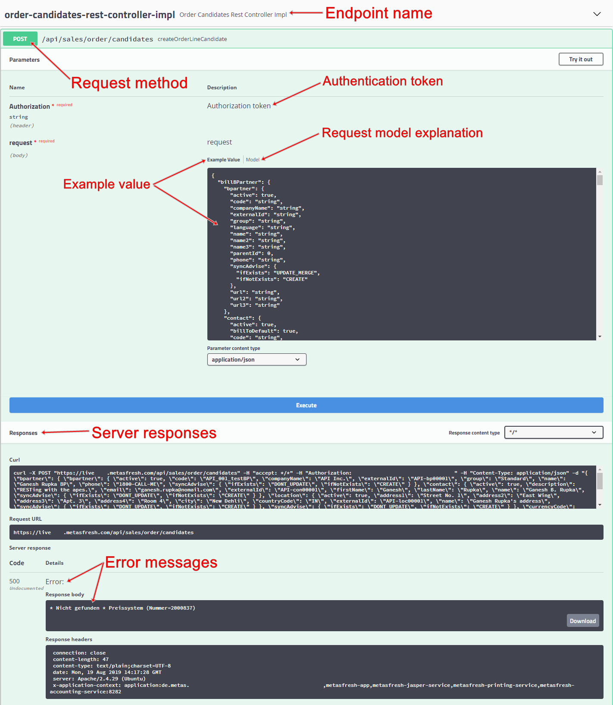

## Overview
By means of the metasfresh web service (REST API) you can transfer external data to metasfresh and retrieve, update or delete existing data entries from the system. This is done via so-called *API endpoints*. Each endpoint is set up for the migration of certain data sets, which can be transferred to the metasfresh application server through server requests in <a href="https://www.json.org/index.html" title="Introducing JSON" target="\_blank">JSON format</a>. A special feature of the metasfresh REST API is that you can also combine data sets that would normally be migrated separately via the respective endpoints, and import them in a single server request, thereby creating several data entries in one go. For example, when migrating a sales order candidate to metasfresh's sales order disposition, both a new business partner and product entry can be created simultaneously.

A template for a JSON server request is provided for each endpoint in the respective input field () and can be viewed, copied and modified using the required data. A description of the request model () with explanations of the individual elements will help you to create your own server request.

In order to use the web service, you require an authentication token that you will have to use to authenticate yourself against the REST API before you can send a server request. This token is provided in the entry of your metasfresh [user](../../webui_collection/EN/Add_user).

## Steps
1. [Have your authentication token ready](../../webui_collection/EN/Authentication_token).
1. Get access to the metasfresh application server REST API.
 >**Note:** The URL is usually composed as follows:<br> `https://instancename###.metasfresh.com/app/swagger-ui/`

1. Open the endpoint you want to use for data migration by clicking on the endpoint name.
1. Click on the desired <a href="https://www.w3schools.com/tags/ref_httpmethods.asp" title="HTTP Request Methods" target="\_blank">request method</a> on the left below the endpoint name.
1. Click  on the right below the request method. The input fields **Authorization token** and **request** become editable.
1. In the field **Authorization token**, paste your authentication token.
1. In the field **request**, paste your prepared JSON server request.
1. Click  to send the server request.
 >**Note:** Any error messages will be displayed in the **Responses** section below.

## Available Endpoints
The endpoints currently available are listed below. Click on an endpoint you would like to learn more about.

- Business partners and contacts
- Data import
- File upload and download
- Invoices and billing candidates
- Products and product categories
- Sales orders
- [Sales order candidates (sales order disposition)](order-candidates-rest-controller-impl)

## JSON Elements

### externalId

```json
"externalId": "2156435"
```

This name-value pair refers to the ID of the data record on the external platform from which the data are retrieved. The `externalId` must be **unique**. It can be found at the end of a data entry's URL in metasfresh behind the window ID, as shown in the following example:

<p style="margin-left:25%; width:50%; border:1px; border-style:solid; border-color:#dddddd; padding:0.5em; text-align:center;">https://<code>{{ base.URL }}</code>/window/123/<strong>2156435</strong></p>

### syncAdvise

```json
"syncAdvise": {
  "ifExists": "DONT_UPDATE",
  "ifNotExists": "CREATE"
}
```

This object is used to check whether a data record already exists or not, and to control what should happen in each case. Depending on the value specified, existing data records can be updated, deleted or excluded from data migration, new data records can be created or the entire migration process terminated.

| Condition | Values | Description |
| :--- | :--- |:--- |
| "ifExists" | •&nbsp;UPDATE_MERGE<br> •&nbsp;UPDATE_REMOVE<br> •&nbsp;DONT_UPDATE | If a data record already exists, it can be updated, deleted, or omitted. |
| "ifNotExists" | •&nbsp;CREATE<br> •&nbsp;FAIL | If a data record does not exist, it can be created or the migration process shall be terminated. |

## Example

