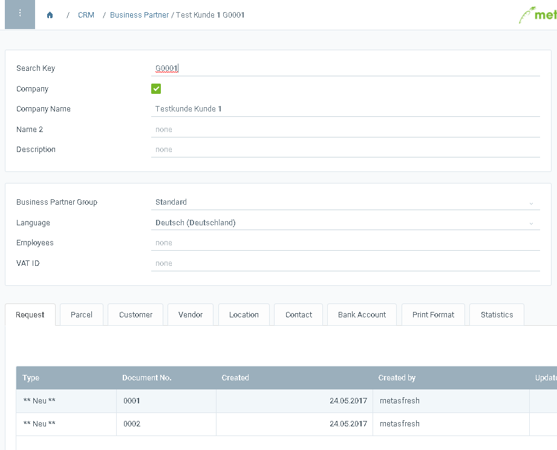

## Overview
In case you want to see the columns behind the fields (independent from your language settings) and the ID of tabs, you may want to enable the *Developer View*.

## Steps
1. [Open Swagger](How_do_I_browse_the_REST_API_using_Swagger).
1. Search for `/debug-rest-controller/setShowColumnNamesForCaptionUsingPUT`   or run this URL directly   `https://<yourserver:port>/app/swagger-ui/index.html#/debug-rest-controller/setShowColumnNamesForCaptionUsingPUT`.
1. Enter the language code `true` into the field **adLanguage**.
1. Click on "Try it out".
1. Refresh the metasfresh WebUI browser session to apply the change.

## Example

### Before enabling Developer View

<kbd></kbd>

### After enabling Developer View

<kbd></kbd>
