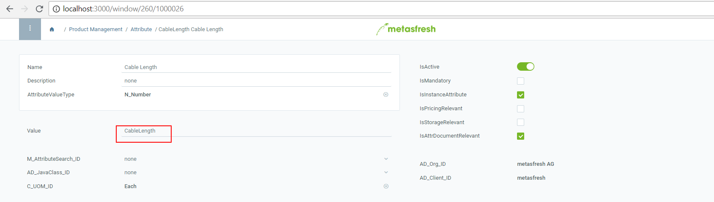
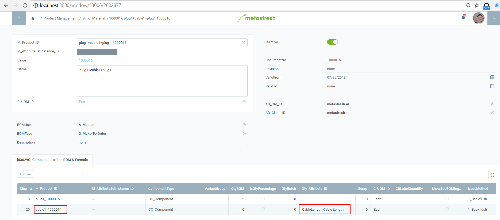
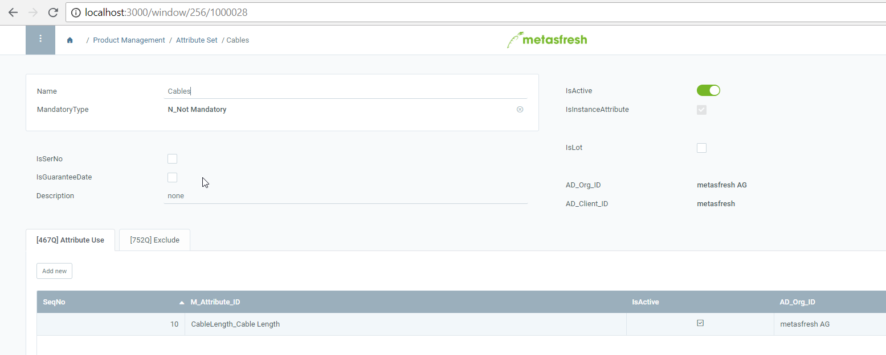
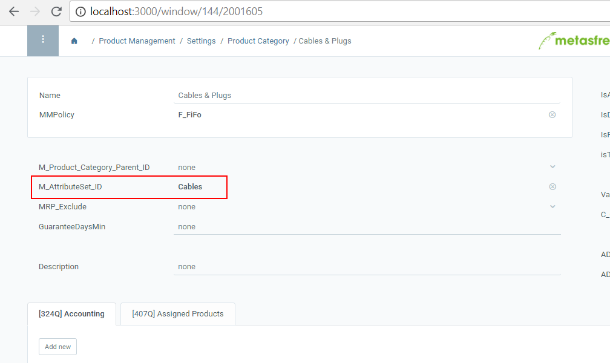
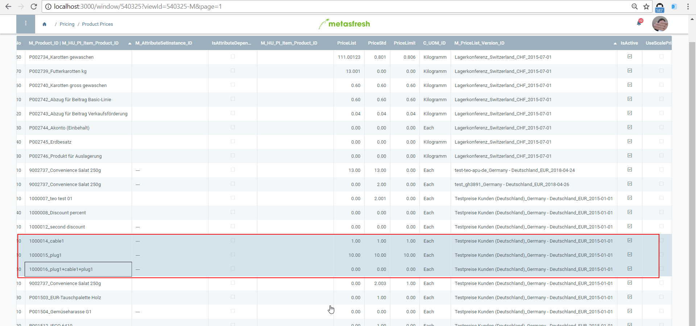
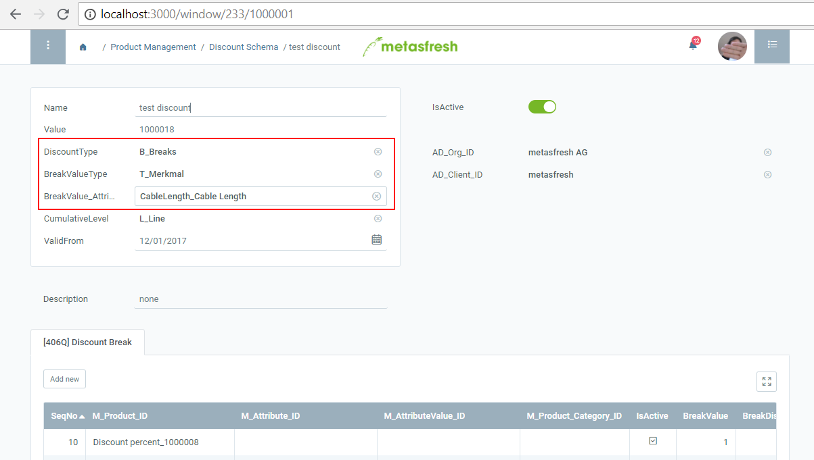
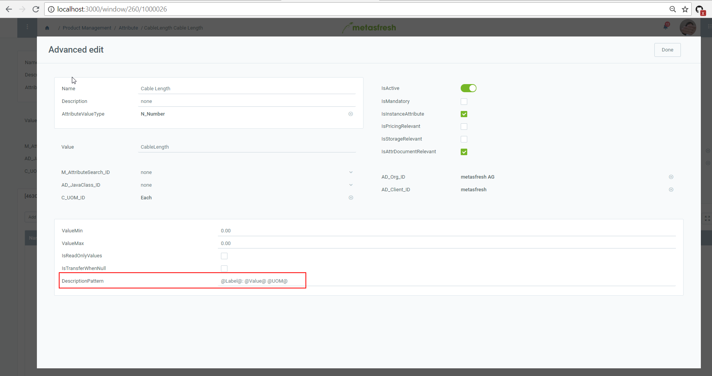
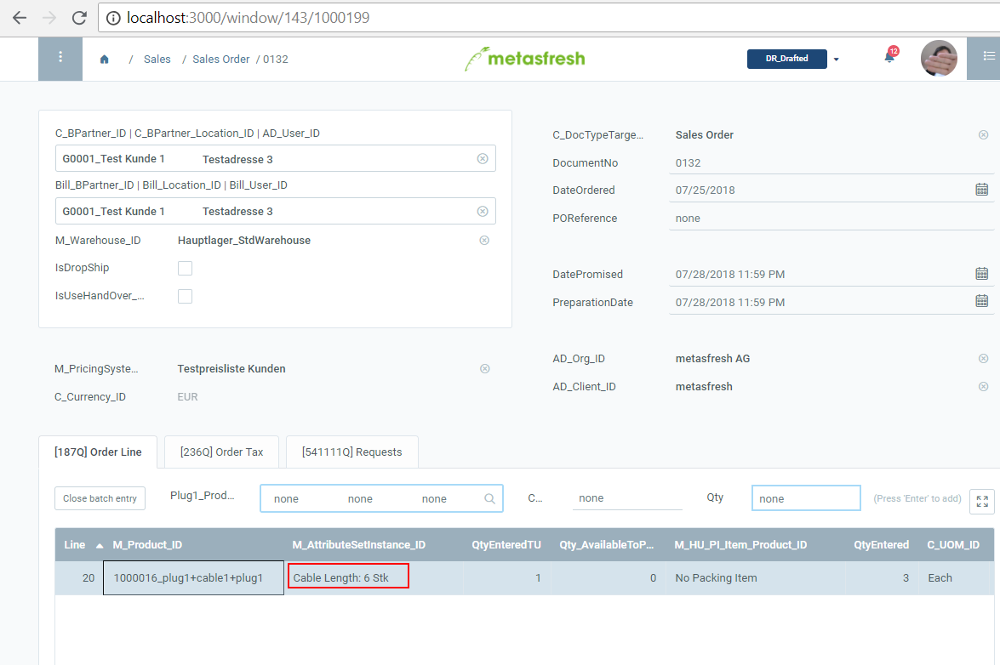

## Technical Setup

### Enable the cable/pipes application profile

By enabling the de.metas.vertical.cables spring profile following changes will be applied:
- cables/pipes specific quick/batch entry will be used in sales order line

The profile shall be enabled for metasfresh-webui-api service, e.g. add following to your application.properties.
In case you are using docker its here: `<yourdockerfolder>/webapi/sources/configs/application.properties`

just add this to the file:

`spring.profiles.active=de.metas.vertical.cables`

## Functional Setup

### Create attribute / label

IMPORTANT: please use the `CableLength` as value.
It is hardcoded in the sales order batch entry.

#### Define the BOM
Remark:
* BOM Type shall be "Make to Order"
* on cable product we use the CableLength external attribute.

#### Configure the attribute set for our BOM

#### Configure the product prices
Remark:
* all components shall be in the price list
* the BOM product shall be in the price list (because of tax category) but it's prices shall be ZERO.

#### Pricing conditions based on CableLength attribute
HINT: check product price's Price Limit. If it's set it will be enforced no matter of what discount you are setting in pricing conditions.

### Configure how an attribute will be rendered in description
e.g. `@Label@: @Value@ @UOM@`

NOTE: if u will leave DescriptionPattern empty, will work as before, i.e. the attribute's value will be rendered.

which might look like this:

