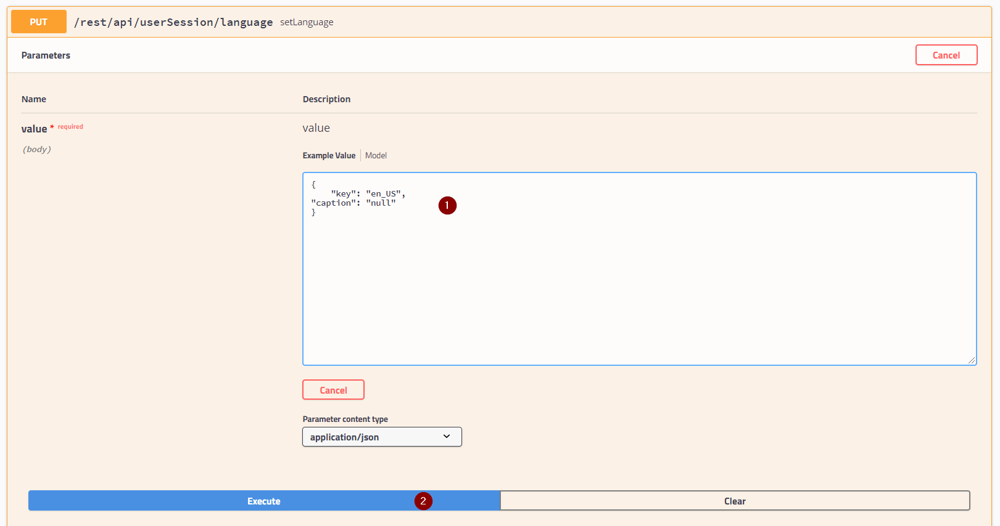

1. [Log in](../../webui_collection/EN/Login) to the system where you want to change the language of your current user session.
1. Open swagger via
   ```
   http://<yourserver:port>/swagger-ui.html#/user-session-rest-controller/setLanguageUsingPUT
   ```

1. Click "Try it out".
1. Enter this code:
   ```json
   -- for English
   {
       "key": "en_US",
   "caption": "null"
   }
   -- for German
   {
       "key": "de_DE",
   "caption": "null"
   }
   -- for Swiss German
   {
       "key": "de_CH",
   "caption": "null"
   }
   ```

1. Click "Execute".

## Example

