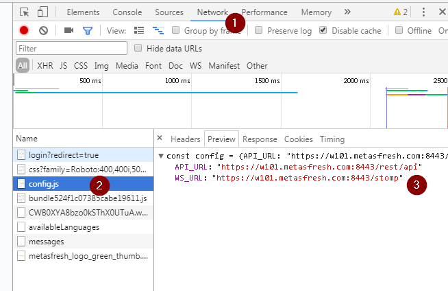

1. Press CTRL + I to enter Developer View
1. Clear Log via 
1. Click on Network
1. Click on the entry named "config.js"
1. check text on the right in tab "preview"
1. Note the values of API_URL and WS_URL

