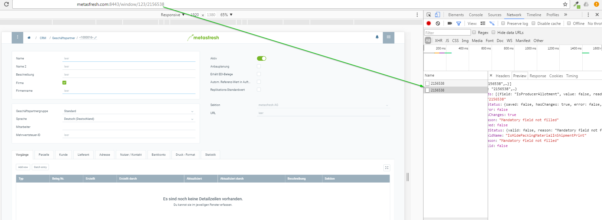

1. Press CTRL + I to enter Developer View
1. Clear Log via 
1. Click on Network
1. Click on an entry with the record number
1. check text on the right in tab "preview"

 *Hint:* You can click on the coloured text to drill down

