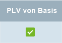

## Übersicht
In metasfresh kannst Du kundenspezifischen [Preislistenversionen](Preislistenversion_anlegen) eine allgemeine Basispreislistenversion zuordnen, deren Basispreise in Kombination mit dem jeweiligen [Preisschema](Preisschema_mit_Regeln) bei der [Übertragung von Preisen und Produkten](Preise_von_Preislistenversion_kopieren) als Grundlage dazu dienen, die neuen kundenspezifischen [Produktpreise](Preis_anlegen) aus ihnen abzuleiten.

Diese [derivativen (von einer Basispreislistenversion abgeleiteten) Preislistenversionen](Preise_von_Preislistenversion_kopieren), welche Teil von unterschiedlichen kundenspezifischen [Preislisten](Preisliste_anlegen) sein können, können ebenfalls unter Berücksichtigung ihrer individuellen Preisschemata alle gleichzeitig aktualisiert werden, solange sie mit ein und derselben allgemeinen Basispreislistenversion verknüpft sind.

## Voraussetzungen
1. [Erstelle eine allgemeine Preisliste](Preisliste_anlegen), die als Grundlage (*Basispreisliste*) für die Berechnung der Produktpreise aller ableitbaren Preislisten herangezogen werden kann.
1. [Erstelle kundenspezifische Preislisten](Preisliste_anlegen) und verknüpfe deren gültige Versionen mit ein und derselben **Version der Basispreisliste** sowie mit einem [**Preislistenschema**](Preisschema_mit_Regeln).
1. Die derivativen Preislistenversionen müssen Teil einer [Verkaufspreisliste](Preisliste_anlegen) sein, welche [mit einem Kunden verknüpft](Zuweisung_Preise_Partner) ist.
1. Für diesen Kunden muss es erlaubt sein, von Basispreislistenversionen abgeleitete Preislistenversionen zu aktualisieren.
 >**Hinweis:** Setze hierzu ein Häkchen bei **PLV von Basis** in der Kundenzeile der Registerkarte "Kunde" des entsprechenden Kundeneintrages unter "[Geschäftspartner](Menu)".  

## Schritte

### Basispreislistenversion aktualisieren
1. [Gehe ins Menü](Menu) und öffne das Fenster "Preisliste".
1. Öffne den Eintrag der allgemeinen Preisliste, welche als Basispreisliste für kundenspezifische Preislisten verwendet wird.
1. [Lege eine neue (aktuelle) Preislistenversion an](Preislistenversion_anlegen) und stelle dafür dieselbe **Basis-Preislistenversion** ein, mit der auch die kundenspezifischen Preislisten verknüpft sind, deren Produktpreise aktualisiert werden sollen.
 >**Hinweis:** Diese Preislistenversion muss keine Produktpreise enthalten. Lediglich ihr **Gültig ab** Datum ist relevant, welches für die Benennung sowie das **Gültig ab** Datum der aktualisierten kundenspezifischen Preislisten verwendet wird.

### Derivative Preislistenversionen aktualisieren
1. Gehe zur Registerkarte "Preislistenversion" unten auf der Seite und [selektiere](AuswahlBelege) die Zeile der neuen Preislistenversion.
1. [Starte die Aktion](AktionStarten) "Auf derivative Preislisten anwenden". Es öffnet sich ein Overlay-Fenster.
1. Klicke auf "Start", um das Overlay-Fenster zu schließen und unter Berücksichtigung des jeweiligen Preisschemas alle kundenspezifischen Preislisten zu aktualisieren, die mit der allgemeinen Basispreisliste verknüpft sind.
