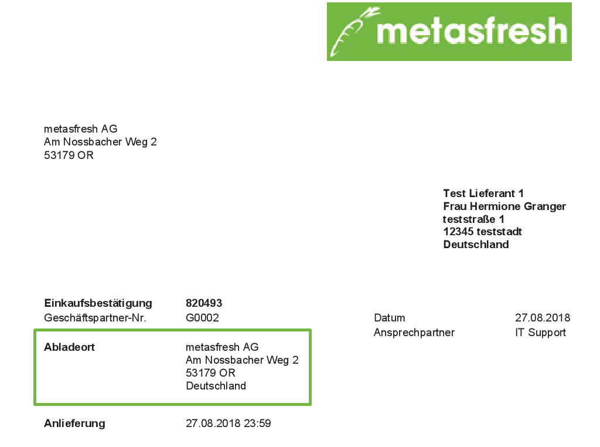

## Überblick
In metasfresh kannst Du einen abweichenden Abladeort festlegen, wenn die Adresse des Wareneingangslagers nicht der Standardadresse der jeweiligen Organisation entspricht. Dieser Abladeort wird anschließend ebenfalls auf den jeweiligen Einkaufsbestätigungen aufgeführt.

## Schritte
1. [Erfasse im Geschäftspartnereintrag der jeweiligen Organisation die Adresse des Abladeortes](Adresse_erfassen_Tab).
1. [Öffne den Eintrag](Menu) des [Lagers](Neues_Lager_anlegen), welches Du für die [Wareneingänge](Zu_Bestellung_Wareneingang_erstellen) benutzen möchtest, und wähle dort die abweichende Adresse als **Standort** aus.
1. [metasfresh speichert automatisch](Speicheranzeige).

## Beispiel

