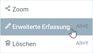
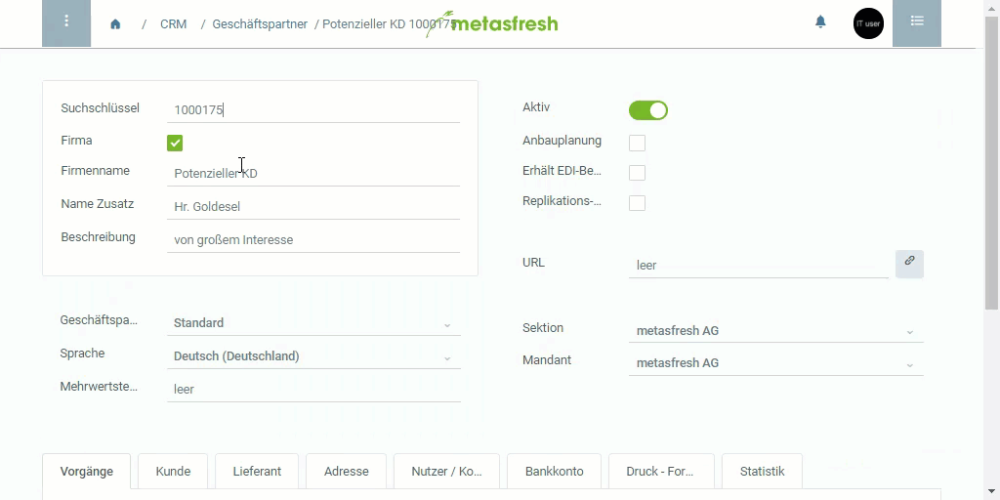

## Schritte
1. Gehe zur betreffenden Registerkarte, z.B. "Kunde" unter "Geschäftspartner".
1. Gehe mit dem Mauszeiger über die betreffende Zeile und öffne mit einem Rechtsklick das Kontextmenü.
1. Klicke auf "Erweiterte Erfassung", um das Menü für die erweiterte Erfassung zu öffnen.
 >**Hinweis:** Drücke alternativ `Alt` + `E` / `⌥ alt` + `E`, wenn Du die betreffende Zeile ausgewählt hast.

 

## Beispiel

