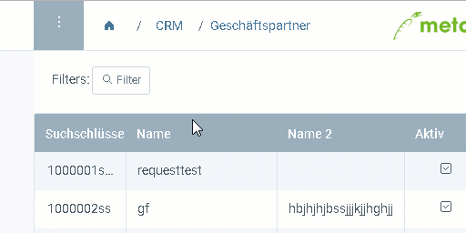
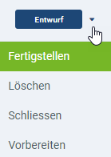
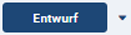

## Überblick
Aktionen sind kontextabhängig und können von jedem Fenster aus gestartet werden. In jedem Fenster stehen folglich andere Aktionen zur Verfügung. 
In metasfresh gibt es drei verschiedene Aktionstypen:

## <a name="aktionsmenue">Allgemeine Aktionen (Aktionsmenü)</a>
Diese Aktionen findest Du im Aktionsmenü.

### Schritte
1. Klicke auf  oder drücke `Alt` + `1` / `⌥ alt` + `1`, um das Aktionsmenü zu öffnen.
1. Klicke auf die gewünschte Aktion.

### Beispiel
<kbd></kbd>

---

## <a name="belegverarbeitung">Belegverarbeitungsaktionen</a>
Diese Aktionen findest Du in Belegen wie [Aufträgen](Auftrag_erfassen), [Bestellungen](Bestellung_erfassen) oder [Produktionsauftägen](NeuerProduktionsauftrag). Mit ihnen kannst Du den Belegstatus einstellen. 

### Schritte
1. Klicke auf  oder drücke `Alt` + `I` / `⌥ alt` + `I`, um das Belegverarbeitungsmenü zu öffnen.
1. Klicke auf den gewünschten Status.

---

## <a name="quick-actions">Quick-Actions</a>
Quick-Actions findest Du bei Prozessen wie [Kommissionierungen](Auftrag_kommissionieren), [Produktherstellungen](ProduktionFertigstellung), [Wareneingängen](Zu_Bestellung_Wareneingang_erstellen) usw. Du erkennst sie anhand des großen  oben rechts im Fenster.

### Schritte
- Klicke auf den Quick-Actions-Button oder drücke `Alt` + `U` / `⌥ alt` + `U`, um die angezeigte Quick-Action auszuführen.
- Klicke auf das Kästchen neben dem Quick-Actions-Button oder drücke `Alt` + `L` / `⌥ alt` + `L`, um das Quick-Actions-Menü zu öffnen und eine andere Aktion als die angezeigte zu wählen.
