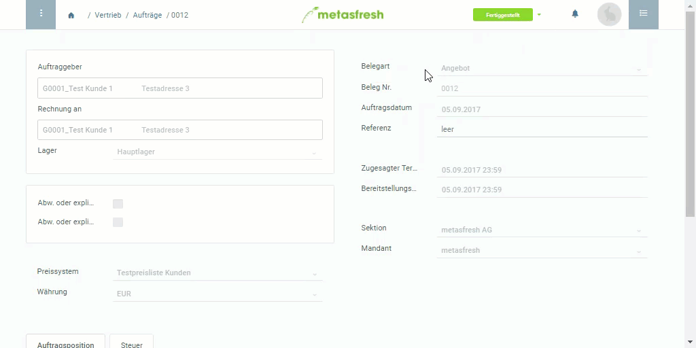

## Schritte
1. Öffne ein fertiges [Angebot](Angebot_erstellen).
1. [Starte die Aktion](AktionStarten#aktionsmenue) "Auftrag aus Angebot". Es öffnet sich ein Overlay-Fenster.
1. Setze das Feld **Belegart** auf *Standardauftrag*.
1. ***Optional:*** Setze ein Häkchen bei **Auftrag abschließen**, wenn der Auftrag nach der Erstellung automatisch fertiggestellt werden soll.
1. Klicke auf "Start", um zu bestätigen und das Overlay-Fenster zu schließen.
 >**Hinweis:** Den neu erstellten Auftrag findest Du unter dem Menüpunkt "[Aufträge](Menu)" wieder.

## Beispiel

