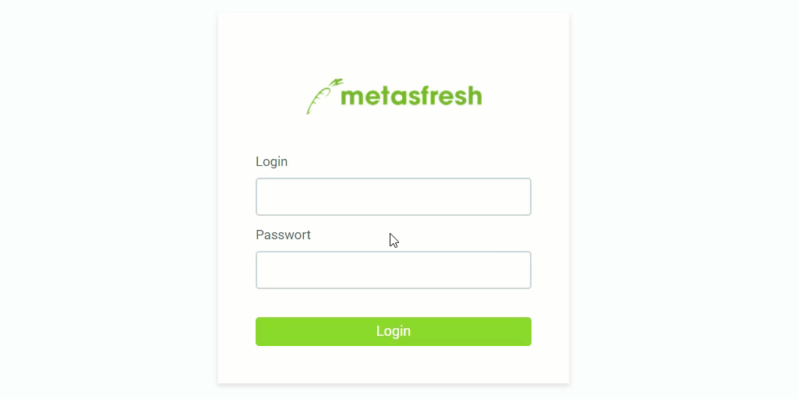

## Schritte
1. Öffne in Deinem Internetbrowser die URL von metasfresh, z.B. http://dockerhost.
1. Melde Dich mit dem Benutzernamen *it* und dem Passwort *demostart* an.
 >**Wichtig:** Beachte beim Benutzernamen und Passwort die ***Groß- und Kleinschreibung***!

## Schritte als Systemadministrator

| **Hinweis:** |
| :- |
| Dieser Nutzer kann die Sprache der Benutzeroberfläche im WebUI nicht so ändern, wie es im Back-end des Java Clients möglich ist. |

1. Öffne in Deinem Internetbrowser die URL von metasfresh, z.B. http://dockerhost.
1. Melde Dich mit dem Benutzernamen *metasfresh* und dem Passwort *metasfresh* an.
 >**Wichtig:** Beachte beim Benutzernamen und Passwort die ***Groß- und Kleinschreibung***!

## Beispiel

