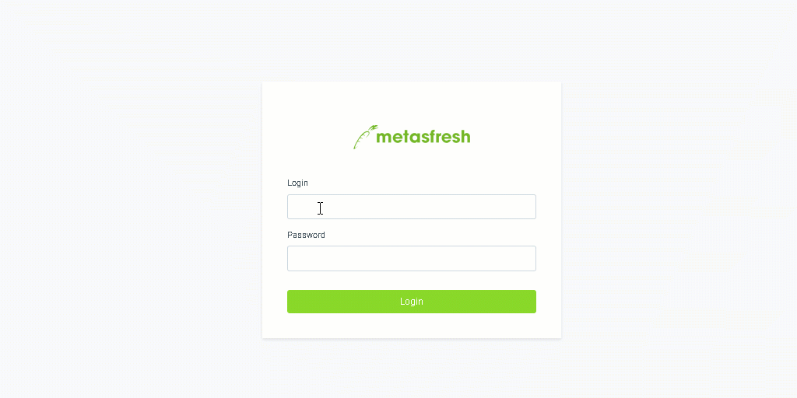

## Schritte

1. Öffne in Deinem Internetbrowser die URL von metasfresh, z.B. http://dockerhost.
1. Melde Dich mit dem Benutzernamen _metasfresh_ und dem Passwort _metasfresh_ an.

 **Wichtig**: Beim Benutzernamen die Groß- und Kleinschreibung beachten!

1. Wähle die Rolle als "WebUI" aus.

## Beispiel

