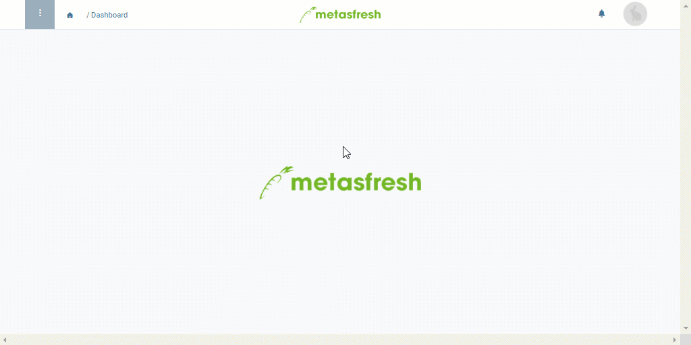

## Überblick
Anruflisten basieren auf den Einstellungen der Anrufplanungsversionen. Je nach Einstellung, z.B. an welchen Wochentagen, mit welcher Häufigkeit (wöchentlich/monatlich) und zu welchen Anrufzeiten des Ansprechpartners, werden die Anruflisten für den im Anrufplanungsschema ausgewählten Zeitraum automatisch erzeugt.

## Voraussetzungen
1. [Lege ein Anrufplanungsschema an](Anrufplanungsschema_anlegen).
1. [Erstelle eine Anrufplanungsversion für das Anrufplanungsschema](Anrufplanungsversion_erstellen).

## Schritte
1. [Gehe ins Menü](Menu) und öffne das Fenster "Anruf Planung".
1. [Selektiere](AuswahlBelege) in der [Listenansicht](Ansichten) das [Anrufplanungsschema](Anrufplanungsschema_anlegen), das Du zur Erzeugung einer Anrufliste verwenden möchtest.
1. [Starte die Aktion](AktionStarten) "Anruflisten generieren". Es öffnet sich ein Overlay-Fenster.
 >**Hinweis:** Diese Aktion findest Du ebenfalls im Aktionsmenü in der Einzelansicht eines Eintrages.

1. Stelle ein **Datum von** und ein **Datum bis** ein, um den genauen Zeitraum festzulegen, für den die Listen erzeugt werden sollen.
1. Klicke auf "Start", um die Listen zu erzeugen und das Overlay-Fenster zu schließen.
1. Öffne den Eintrag des Anrufplanungsschemas und [springe über die verknüpften Belege](SpringezuBelegen) in das Fenster "Anrufliste" (unter CRM in der Sidebar).
1. In diesem Fenster kannst Du die neu erzeugte Anrufliste einsehen und verwalten.

## Nächste Schritte
- Halte Anruflisten stets aktuell, indem Du [Anrufe als *getätigt* markierst](Anrufplanung_Anruf_getaetigt).
- [Erteile neue Aufträge, indem Du direkt aus der Anrufliste in die Auftragserfassung springst](Anrufplanung_Auftrag_erteilen).

## Beispiel

