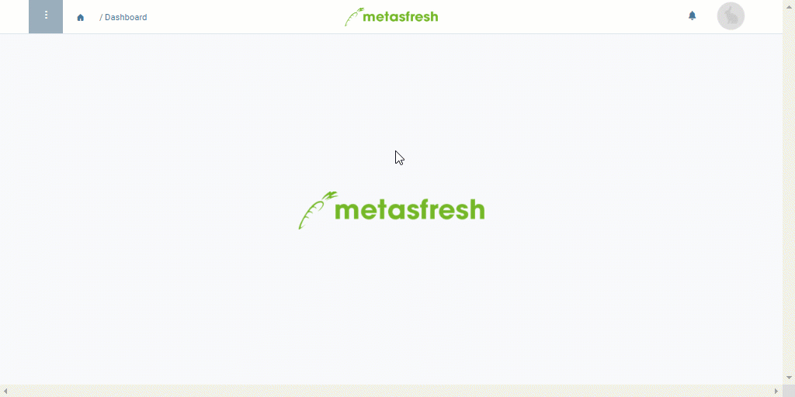

## Überblick
Wenn Du einen Kontakt aus Deiner Anrufliste erreicht und das Gespräch mit ihm/ihr geführt hast, kannst Du den Anruf als getätigt markieren, um so besser nachvollziehen zu können, welche Telefonate noch anstehen.

Ergibt sich aus einem Telefonat ein Kundenauftrag, kannst Du dies gleichfalls notieren und [unmittelbar aus dem Eintrag in die Auftragserfassung springen](Anrufplanung_Auftrag_erteilen).

Mithilfe der [Filterfunktion](Anrufplanung_Anrufe_filtern) kannst Du dir schnell einen Überblick über ausstehende Telefonate verschaffen.

## Voraussetzungen
- [Erzeuge eine automatische Anrufliste](Anruflisten_automatisch_generieren).

## Schritte
1. [Gehe ins Menü](Menu) und öffne das Fenster "Anrufliste".

### Anruf als getätigt markieren

#### Alternative A
1. Öffne den Eintrag des Partners, mit dem Du ein Gespräch geführt hast.
1. Setze ein Häkchen bei **Anruf getätigt**.
1. [metasfresh speichert automatisch](Speicheranzeige).

#### Alternative B
1. [Selektiere](AuswahlBelege) in der [Listenansicht](Ansichten) den Eintrag des Partners, mit dem Du ein Gespräch geführt hast.
1. [Starte die Quick-Action](AktionStarten) "Als angerufen markieren". Das Kontrollkästchen in der Spalte **Anruf getätigt** des selektierten Eintrags erhält ein Häkchen.
 >**Hinweis 1:** Diese Aktion findest Du ebenfalls im Aktionsmenü sowohl in der Listenansicht als auch in der Einzelansicht eines Eintrags.  
 >**Hinweis 2:** Es kann immer nur ein Eintrag auf einmal auf diese Weise als *getätigt* markiert werden.

## Nächste Schritte (optional)
- [Erteile neue Aufträge, indem Du direkt aus der Anrufliste in die Auftragserfassung springst](Anrufplanung_Auftrag_erteilen).

## Beispiel

