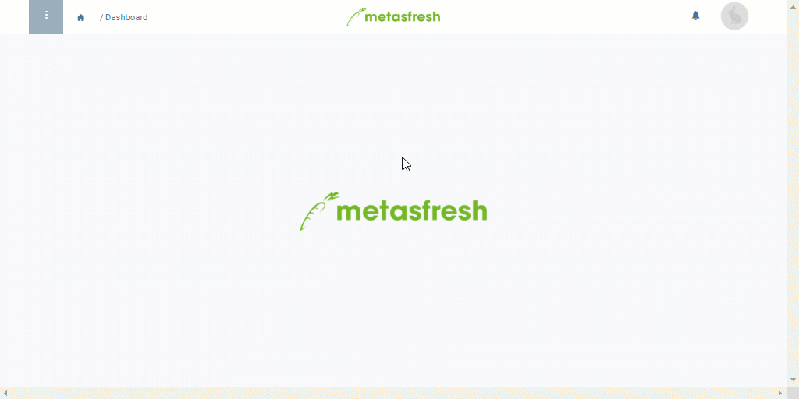

## Überblick
Wenn Du einen Kontakt aus Deiner Anrufliste erreicht und das Gespräch mit ihm/ihr geführt hast, kannst Du den [Anruf als getätigt markieren](Anrufplanung_Anruf_getaetigt), um so besser nachvollziehen zu können, welche Telefonate noch anstehen.

Ergibt sich aus einem Telefonat ein Kundenauftrag, kannst Du dies gleichfalls notieren und unmittelbar aus dem Eintrag in die Auftragserfassung springen.

Mithilfe der [Filterfunktion](Anrufplanung_Anrufe_filtern) kannst Du dir schnell einen Überblick über ausstehende Telefonate verschaffen.

## Voraussetzungen
- [Erzeuge eine automatische Anrufliste](Anruflisten_automatisch_generieren).

## Schritte

### Auftrag erstellen
1. [Gehe ins Menü](Menu) und öffne das Fenster "Anrufliste".
1. [Selektiere](AuswahlBelege) in der [Listenansicht](Ansichten) den Eintrag des Partners, mit dem Du ein Gespräch geführt hast, woraus sich ein Kundenauftrag ergeben hat.
1. [Starte die Quick-Action](AktionStarten) "Auftrag erstellen". Es öffnet sich in demselben Tab ein neuer Auftrag, der bereits mit den Daten des Geschäftspartners ausgefüllt ist.
 >**Hinweis:** Diese Aktion findest Du ebenfalls im Aktionsmenü sowohl in der Listenansicht als auch in der Einzelansicht eines Eintrags.

1. Fahre fort mit dieser [Anleitung zur Auftragserfassung](Auftrag_erfassen) ab **Schritt 4**.

| **Hinweis:** |
| :--- |
| Sobald die Aktion "Auftrag erstellen" aus der Anrufliste gestartet wird, erhalten die Kontrollkästchen **Anruf getätigt** und **Auftrag erteilt** des jeweiligen Eintrags automatisch ein Häkchen. |

## Beispiel

