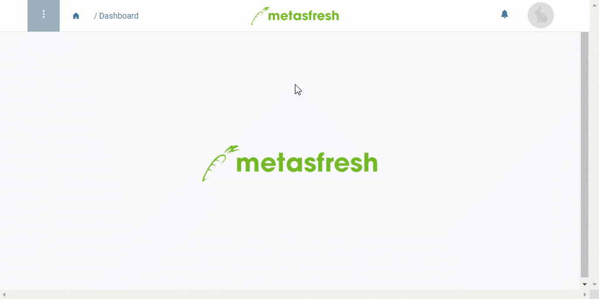

## Überblick
Ein Anrufplanungsschema kann mehrere Anrufplanungsversionen umfassen, die sich aufgrund ihrer jeweiligen Gültigkeitszeiträume gegenseitig automatisch nacheinander ablösen. Dadurch lassen sich prospektive Anruflisten erzeugen, mit denen Telefonate weit im Voraus geplant werden können, wodurch Du stets auf aktuellem Stand bist und immer einen Überblick über die zu tätigenden Anrufe, Anrufzeiten und Ansprechpartner behältst.

## Schritte
1. [Gehe ins Menü](Menu) und öffne das Fenster "Anruf Planung".
1. [Lege ein neues Anrufplanungsschema an](Neuer_Datensatz_Fenster_Webui).
1. Benenne das Schema im Feld **Name**, z.B. "Kundenzufriedenheitsbefragung".
1. [metasfresh speichert automatisch](Speicheranzeige).

## Nächste Schritte
- [Erstelle eine Anrufplanungsversion](Anrufplanungsversion_erstellen).

## Beispiel

