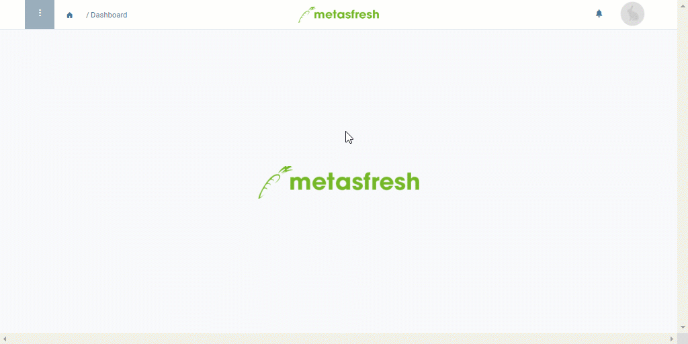

## Überblick
In einer Anrufplanungsversion lässt sich festlegen, an welchen Tagen und in welchem zeitlichen Abstand bestimmte Geschäftspartner kontaktiert werden sollen. Hierzu können je nach Bedarf verschiedene Parameter (Wochentage, Wiederholungen, Zeiträume) sowohl miteinander als auch in Verbindung mit den Geschäftspartnern und ihren individuellen Anrufzeiten kombiniert werden. Durch Verknüpfung mit einem Anrufplanungsschema können anschließend prospektive Anruflisten erzeugt werden, mit denen sich Telefonate weit im Voraus planen lassen, wodurch Du stets auf aktuellem Stand bist und immer einen Überblick über die zu tätigenden Anrufe, Anrufzeiten und Ansprechpartner behältst.

## Voraussetzungen
- [Lege ein Anrufplanungsschema an](Anrufplanungsschema_anlegen).

## Schritte

### Anrufplanungsschema auswählen und Version anlegen
1. [Gehe ins Menü](Menu) und öffne das Fenster "Anruf Planung Version".
1. [Lege eine neue Anrufplanungsversion an](Neuer_Datensatz_Fenster_Webui).
1. Wähle im Feld **Anruf Planung** ein Anrufplanungsschema aus, z.B. *Kundenzufriedenheitsbefragung*.
1. Benenne die Anrufplanungsversion im Feld **Name**, z.B. "Kundenbefragung Sommersaison".
1. Stelle ein **Gültig ab** Datum ein.
 >**Hinweis:** Liegt das Datum in der *Vergangenheit*, gilt die Version *ab sofort*. Liegt es in der *Zukunft*, gilt sie *erst ab diesem Datum*. Ältere Versionen werden von der jeweils neueren automatisch überschrieben.

### Wochentage, Wiederholungen und Zeiträume festlegen
Du kannst folgende Parameter je nach Bedarf miteinander kombinieren:

| Parameter | Beschreibung |
| :--- | :--- |
| Wochentage | Montag, Dienstag, Mittwoch, Donnerstag, Freitag, Samstag, Sonntag |
| Zeitraum | wöchentlich / monatlich |
| Frequenz | •&nbsp;jede *n*-te Woche  •&nbsp;jeden *n*-ten Monat  •&nbsp;*n*-ter Tag des Monats |

 

| **Wichtiger Hinweis:** |
| :--- |
| Die Angabe von mindestens einem Zeitraum und/oder einer Frequenz ist notwendig, damit Anruflisten erfolgreich generiert werden können. |

### Geschäftspartner hinzufügen
1. Gehe zur Registerkarte "Anruf Planung Version Position" unten auf der Seite und klicke auf . Es öffnet sich ein Overlay-Fenster.
1. Gib in das Feld **Geschäftspartner** einen Teil des Namens oder der Nummer des [Geschäftspartners](Neuer_Geschaeftspartner) ein und klicke auf den passenden Treffer in der <a href="Keyboard_Shortcuts_Liste#dropdown" title="Dynamisches Suchfeld (Autocomplete)">Dropdown-Liste</a>.
 >**Hinweis:** Sofern dem Geschäftspartner ein Kontakt zugeordnet wurde, wird dieser hier automatisch übernommen.

1. Wähle ebenfalls im Feld **Geschäftspartner** einen Kontakt aus, sofern dem Geschäftspartner mehr als einer zugeordnet wurde.
1. Gib im Feld **Erreichbar von** die früheste Uhrzeit an, ab der der Partner zu erreichen ist.
 >**Hinweis:** Klicke hierzu in das Eingabefeld, dann auf die Zeitanzeige in dem kleinen Overlay und benutze anschließend die Pfeile , um die Uhrzeit Deiner Wahl einzustellen oder tippe sie manuell ein.

1. Gib im Feld **Erreichbar bis** die späteste Uhrzeit an, bis zu der der Partner zu erreichen ist.
 >**Hinweis:** Klicke hierzu in das Eingabefeld, dann auf die Zeitanzeige in dem kleinen Overlay und benutze anschließend die Pfeile , um die Uhrzeit Deiner Wahl einzustellen oder tippe sie manuell ein.

1. Klicke auf "Bestätigen", um das Overlay-Fenster zu schließen und den Geschäftspartner zur Liste hinzuzufügen.
 >**Hinweis:** Wiederhole die Schritte 1 bis 6, um weitere Geschäftspartner hinzuzufügen.

1. [metasfresh speichert automatisch](Speicheranzeige).

## Nächste Schritte
- [Erzeuge automatische Anruflisten](Anruflisten_automatisch_generieren).

## Beispiel

