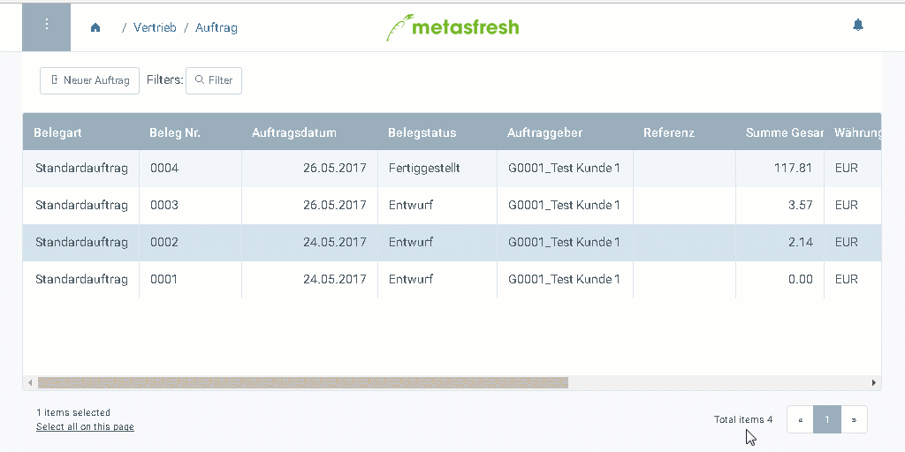
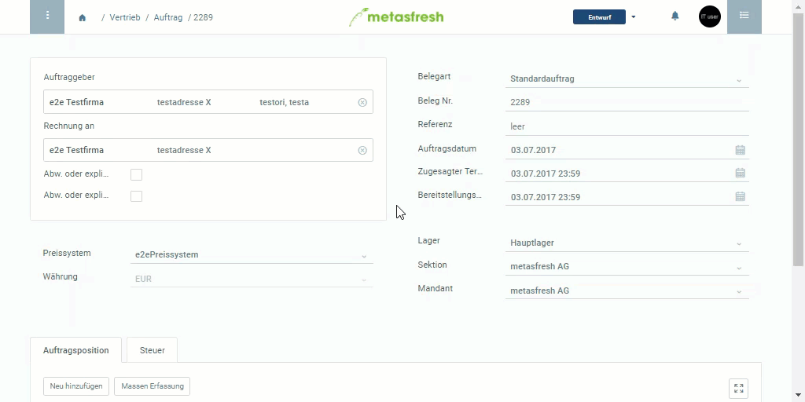

## Listenansicht
Sämtliche Fenster (z.B. "Aufträge") öffnen prinzipiell in der Listenansicht. Dort sind Bearbeitungen nicht möglich, sondern nur das Filtern und Sortieren von Datensätzen.

## Einzelansicht
Bei einem Doppelklick auf einen Datensatz oder beim [Neuanlegen eines Datensatzes ](Neuer_Datensatz_Fenster_Webui) wechselt metasfresh automatisch in die Einzelansicht.
Dort können Datenänderungen vorgenommen werden.

Um von der Einzelansicht wieder zurück in die Listenansicht zu wechseln, brauchst Du nur in dem Navigationsmenü auf den vorherigen Punkt zu klicken. Alternativ kannst Du auch den Zurück-Button Deines Internetbrowsers verwenden.

Hier siehst Du, wie Du zwischen Einzel- und Listenansicht hin und her wechseln kannst:

## Erweiterte Erfassung
Die Einzelansicht zeigt nur die wichtigsten Felder. Um alle weiteren Felder zu sehen und zu bearbeiten, kannst Du über das [Aktionsmenü](AktionStarten) in die "Erweiterte Erfassung" wechseln.
 > Hinweis: Tastenkombination `Strg + E` verwenden, um in das Fenster "Erweiterte Erfassung" zu wechseln.

Hier siehst Du, wie Du von der Einzelansicht in die Erweiterte Erfassung wechselst:

