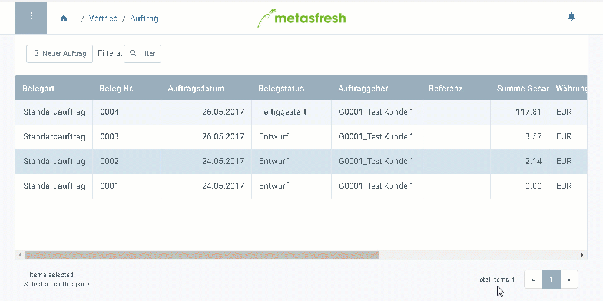
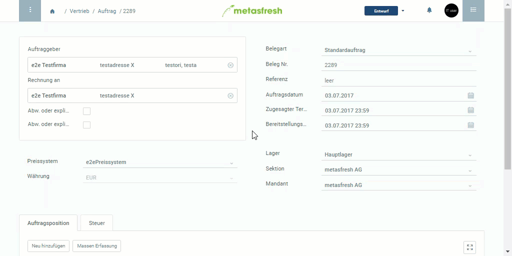

## <a name="listenansicht">Listenansicht</a>
Sämtliche Fenster in metasfresh öffnen sich grundsätzlich zuerst in der Listenansicht. Dort sind Bearbeitungen nicht möglich, sondern nur das [Filtern](Filterfunktion), [Selektieren](AuswahlBelege) und Sortieren von Datensätzen.

### Gefilterte Listen statt individueller Fenster
metasfresh bietet die Flexibilität, alle zentral eindeutig verwalteten Daten in beliebiger, individuell definierter Form anzuzeigen, ob in Fenstern, Formularen, Registerkarten, auf Belegen usw. Die Listenansicht zählt ebenfalls dazu und ermöglicht dank der dort integrierten [Filterfunktion](Filterfunktion) zudem eine vielfältige Nutzung derselben Ansicht zur Anzeige ausgewählter Daten. Dies erspart die Ergänzung eines neuen Fensters und damit eines neuen Menüpunktes, wodurch wiederum das ganze System schlank und übersichtlich gehalten wird. Des Weiteren lassen sich auf diese Weise ausgewählte [Daten schnell und einfach aus dem System exportieren](Datenexport_aus_metasfresh) (z.B. für **Berichte/Reports**).

Durch Verwendung der Filterfunktion kann beispielsweise das Fenster "[Geschäftspartner](Neuer_Geschaeftspartner)" zur Anzeige von ausschließlich [Kunden](Neuer_Geschaeftspartner_Kunde), [Lieferanten](Neuer_Geschaeftspartner_Lieferant) oder anderer Eigenschaftskombinationen genutzt werden, ohne separate Fenster dafür erforderlich zu machen.

## <a name="einzelansicht">Einzelansicht (Detailansicht)</a>
Bei einem Doppelklick auf einen Eintrag in der Listenansicht oder beim [Anlegen eines neuen Eintrags](Neuer_Datensatz_Fenster_Webui) wechselt metasfresh in die Detailansicht, in der die Daten bearbeitet werden können.

Um von der Detailansicht wieder zurück in die Listenansicht zu wechseln, brauchst Du nur im Pfad der "Breadcrumb-Navigation" auf den vorherigen Menüpunkt zu klicken. Alternativ kannst Du auch den Zurück-Button Deines Internetbrowsers verwenden.

Hier siehst Du, wie Du zwischen Detail- und Listenansicht hin und her wechseln kannst:

<kbd></kbd>

## <a name="erw-erfassung">Erweiterte Erfassung</a>
In der Detailansicht werden nur die wichtigsten, am häufigsten verwendeten Felder angezeigt. Um alle Felder eines Datensatzes zu sehen und auch die für bestimmte Zwecke benötigten Felder zu bearbeiten, kannst Du über das [Aktionsmenü](AktionStarten#aktionsmenue) in die "Erweiterte Erfassung" wechseln. Das Gleiche gilt auch für die [Tabellen der Registerkarten](AdvancedEditTab_Öffnen) im unteren Bereich der Datensätze.
 >**Hinweis:** Drücke `Alt` + `E` / `⌥ alt` + `E`, um in die "Erweiterte Erfassung" zu wechseln.

Hier siehst Du, wie Du von der Einzelansicht in die Erweiterte Erfassung wechselst:

<kbd></kbd>
