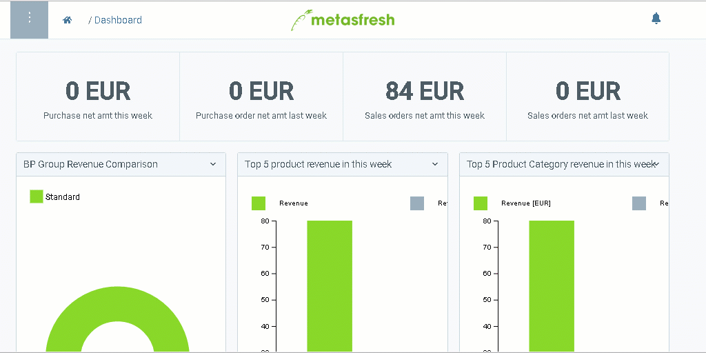

## Schritte

1. [Gehe ins Menü](Menu) und öffne den Link "Aufträge".
1. [Lege einen neuen Auftrag an](Neuer_Datensatz_Fenster_Webui).
1. Gib im Feld **Auftraggeber** einen Teil des Kundennamens oder der Kundennummer ein.
 > Hinweis 1: Drücke die `LEERTASTE`, um alle Kunden zu sehen.  
 > Hinweis 2: Auswahl des Treffers mit Maus oder 

1. [metasfresh speichert automatisch](Speicheranzeige).

### Zeilen hinzufügen
1. Gehe zur Registerkarte "Auftragsposition" unten auf der Seite und klicke auf "Massen Erfassung", um die Auftragszeileneingabe zu öffnen.
 > Hinweis: Tastenkombination `Strg + Q`

1. Gib in das Feld **Produkt** einen Teil des Produktnamens oder der Produktnummer ein und klicke auf eines der Ergebnisse.
 > Hinweis 1: Drücke die `LEERTASTE`, um alle Produkte zu sehen.  
 > Hinweis 2: Auswahl des Treffers mit Maus oder 

1. Wechsle in das Feld **Menge**.
 > Hinweis: Mit Maus oder `TAB`-Taste

1. Gib eine Menge ein und drücke `ENTER`, um die Zeile hinzuzufügen.
 > Hinweis: Wiederhole die Schritte 2 bis 4 so oft, bis Du alle Auftragszeilen erfasst hast.

### Beleg fertigstellen

1. [Stelle den Beleg fertig](BelegverarbeitungFertigstellen).
1. [Öffne die PDF-Vorschau](PDFVorschau).

## Beispiel

