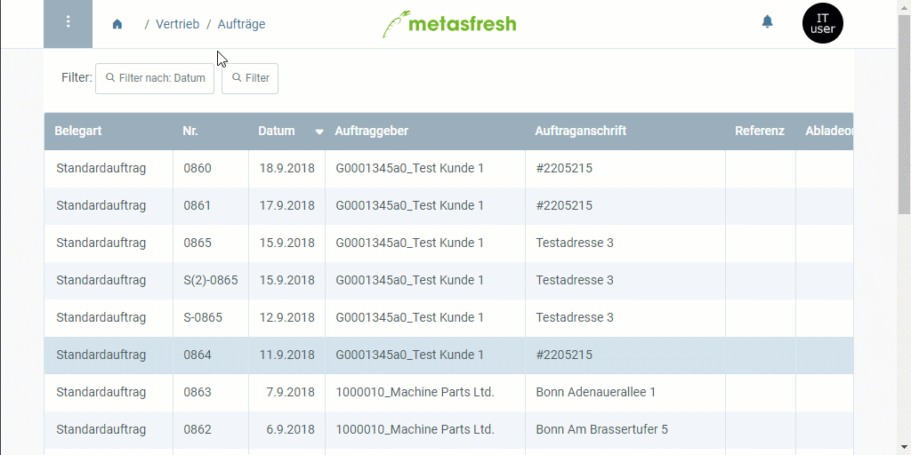

## Übersicht
In metasfresh kannst Du einen Auftrag samt allen damit verbundenen Belegen, wie z.B. Lieferscheinen, Rechnungen, Verträgen, Vertragsverlängerungen usw., schnell und einfach stornieren.

So können beispielsweise Fehler, die vom Auftrag in die Folgebelege übertragen wurden, rechtzeitig und in ihrer Gesamtheit unwirksam gemacht werden. Anschließend wird automatisch ein Entwurf des ursprünglichen Auftrags erstellt, den Du dann überarbeiten und erneut fertigstellen kannst.

## Schritte
1. [Gehe ins Menü](Menu) und öffne das Fenster "Aufträge".
1. [Selektiere](AuswahlBelege) in der [Listenansicht](Ansichten) den [fertiggestellten Auftrag](Auftrag_erfassen), den Du samt Folgebelegen stornieren möchtest.
1. [Starte die Aktion](AktionStarten) "Ausgewählten Auftrag mit Folgebelegen stornieren". Es öffnet sich ein Overlay-Fenster.
 >**Hinweis:** Diese Aktion kannst Du auch direkt aus dem Eintrag des jeweiligen Auftrags starten.

1. Klicke auf "Start", um die Stornierung durchzuführen und das Overlay-Fenster zu schließen.
1. Drücke `F5`, um das Auftragsfenster neuzuladen und den stornierten Auftrag zu sehen.
  

| **Hinweis:** |
| :- |
| Der Nummer des stornierten Auftrags wird ein "S-" vorangestellt (z.B. "S-0864") und der Status der Folgebelege auf *rückgängig* geändert. Der neu erstellte Entwurf erhält die ursprüngliche Auftragsnummer (z.B. "0864") und kann so dem stornierten Auftrag zugeordnet werden und mithilfe der [Filterfunktion](Filterfunktion) unter dem Menüpunkt "[Aufträge](Menu)" wiedergefunden werden. |

## Nächste Schritte
- Überprüfe den neu erstellten Entwurf des Auftrags und [stelle ihn fertig](BelegverarbeitungFertigstellen).

## Beispiel

